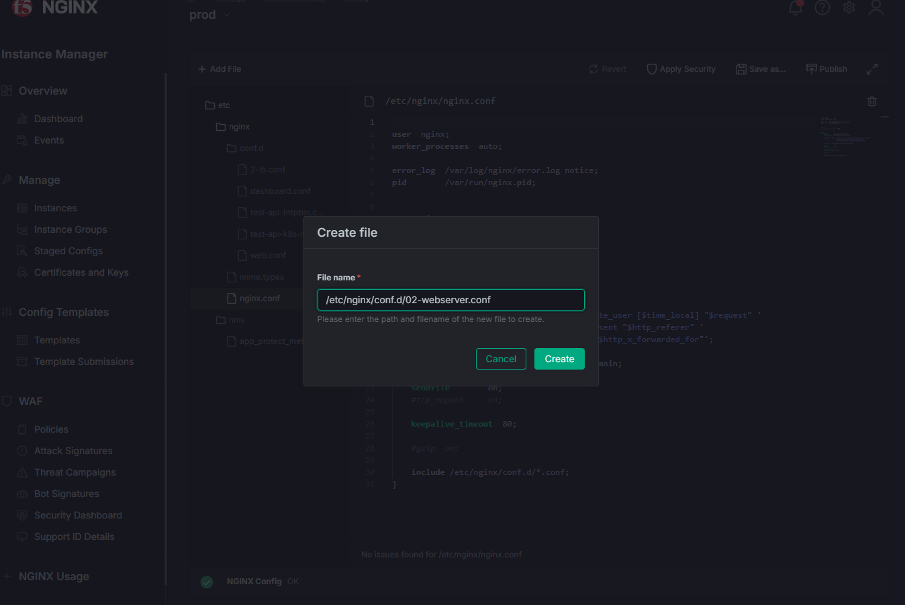
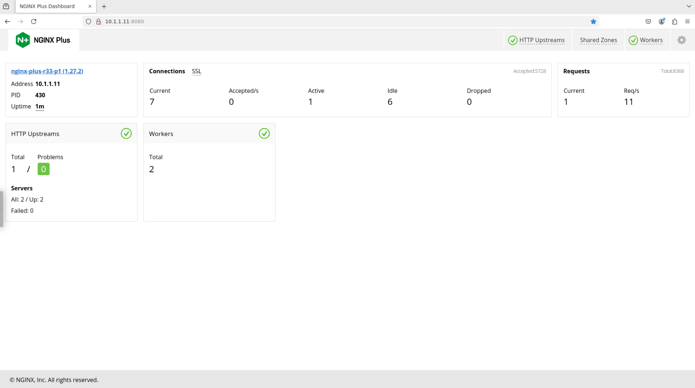
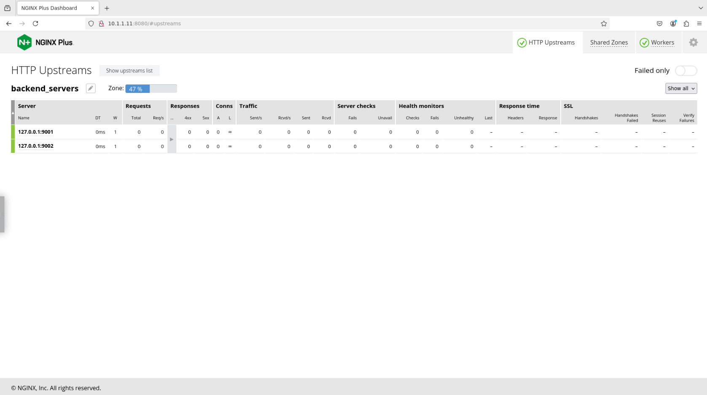

## NGINX의 역사와 아키텍처

NGINX | NGINX
:-------------------------:|:-------------------------:
|

NGINX는 2002년 Igor Sysov가 러시아 인터넷 검색 기업인 rambler.ru에 재직 중 개발하였습니다. Rambler가 지속적으로 성장하면서, Igor는 Apache HTTP 서버의 실질적인 한계인 동시 HTTP 요청 10,000건에 계속 부딪혔습니다. 더 많은 트래픽을 처리하는 유일한 방법은 서버를 더 구매하고 운영하는 것뿐이었습니다. 그래서 그는 `C10k 동시성 문제`, 즉 단일 Linux 서버에서 10,000건 이상의 동시 요청을 처리하는 방법을 해결하기 위해 NGINX를 개발하였습니다.

Igor는 `NGINX Worker`라는 새로운 TCP 연결 및 요청 처리 개념을 만들었습니다. Worker는 들어오는 TCP 연결을 지속적으로 대기하다가 요청을 즉시 처리하고 응답을 전달하는 Linux 프로세스입니다. 이는 속도와 성능으로 잘 알려진 `네이티브 C 프로그래밍 언어`로 작성된 이벤트 기반 프로그램 로직을 기반으로 합니다. 특히 NGINX Worker는 모든 CPU를 활용할 수 있으며, 컴퓨팅 하드웨어가 확장됨에 따라 거의 선형적인 성능 곡선을 제공하며 성능도 함께 향상됩니다. 이 NGINX Worker 아키텍처에 관심이 있다면 참고할 수 있는 다양한 자료가 있습니다.

또 주목할 만한 NGINX의 아키텍처 개념으로 `NGINX Master` 프로세스가 있습니다. 마스터 프로세스는 Linux OS와 상호작용하고, Worker를 제어하며, 설정 파일을 읽고 유효성을 검사하고, 에러 및 로그 파일에 기록하며, 기타 NGINX 및 Linux 관리 작업을 수행합니다. 마스터 프로세스는 컨트롤 플레인 프로세스로, Worker는 데이터 플레인 프로세스로 간주됩니다. `제어 기능과 데이터 처리 기능의 분리`는 고동시성, 대용량 웹 트래픽 처리에도 매우 유리합니다.

NGINX는 또한 `공유 메모리 모델`을 사용하여 모든 Worker가 공통 요소에 동등하게 접근할 수 있습니다. 이를 통해 전체 메모리 사용량이 크게 줄어들어 NGINX는 매우 가볍고, 컨테이너 및 소형 컴퓨팅 환경에 이상적입니다. 실제로 레거시 플로피 디스크에서도 NGINX를 실행할 수 있습니다!

아래 `NGINX 아키텍처` 다이어그램에서 이러한 다양한 핵심 컴포넌트와 상호 관계를 확인할 수 있습니다. 트래픽을 처리하는 Worker의 데이터 흐름 기능과 제어 및 관리 기능이 분리되어 독립적으로 운영됨을 알 수 있습니다. References 섹션에서 NGINX 핵심 아키텍처와 개념에 대한 링크를 확인할 수 있습니다.

>> 바로 이 독특한 아키텍처가 NGINX를 강력하고 효율적으로 만드는 핵심입니다.


- 2004년, NGINX는 오픈 소스 소프트웨어(OSS)로 공개되었습니다. 빠르게 인기를 얻으며 수백만 개의 웹사이트에 채택되었습니다.

- 2013년, 엔터프라이즈 고객을 위한 추가 기능과 상업적 지원을 제공하는 NGINX Plus가 출시되었습니다.

<br/>

## NGINX Plus란 무엇인가?

NGINX Plus
:-------------------------:


NGINX Plus는 기본 NGINX 오픈소스(OSS) 빌드 위에 엔터프라이즈 기능을 추가한 `NGINX의 상용 버전`입니다. Plus 기능 요약은 다음과 같습니다:

- 다운타임 없는 동적 재설정 리로드
- 다운타임 없는 동적 NGINX 소프트웨어 업데이트
- 동적 DNS 확인 및 DNS 서비스 디스커버리
- 액티브 헬스 체크
- 240개 이상의 메트릭을 제공하는 NGINX Plus API 및 대시보드
- NGINX JavaScript Prometheus 익스포터 라이브러리
- 동적 업스트림
- 키-값 저장소
- 캐시 퍼지 API 제어
- 고가용성을 위한 NGINX 클러스터링
- 사용자 인증을 위한 OIDC 기반 JWT 처리
- F5 WAF for NGINX 방화벽

# (NGINX Plus 설치) 건너뜀 - 이미 완료됨
	
	sudo mkdir -p /etc/ssl/nginx
 	sudo cp <downloaded-file-name>.crt /etc/ssl/nginx/nginx-repo.crt
	sudo cp <downloaded-file-name>.key /etc/ssl/nginx/nginx-repo.key
 	sudo apt update && \
	sudo apt install apt-transport-https \
                 lsb-release \
                 ca-certificates \
                 wget \
                 gnupg2 \
                 ubuntu-keyring
 	wget -qO - https://cs.nginx.com/static/keys/nginx_signing.key \
    	| gpg --dearmor \
    	| sudo tee /usr/share/keyrings/nginx-archive-keyring.gpg >/dev/null
 		
   	#NGINX Plus 저장소 추가
  	printf "deb [signed-by=/usr/share/keyrings/nginx-archive-keyring.gpg] \
	https://pkgs.nginx.com/plus/ubuntu `lsb_release -cs` nginx-plus\n" \
	| sudo tee /etc/apt/sources.list.d/nginx-plus.list

  	#nginx-plus apt 설정을 /etc/apt/apt.conf.d에 다운로드
   	sudo wget -P /etc/apt/apt.conf.d https://cs.nginx.com/static/files/90pkgs-nginx
	
    #저장소 정보 업데이트
 	sudo apt update
  	
    #nginx-plus 패키지 설치
   	sudo apt install -y nginx-plus
	
    #설치된 버전 확인
 	nginx -v

<br/>

# LAB-1: 탐색 - NGINX Plus 기본 설정 살펴보기

이 섹션에서는 NGINX 및 Linux 설정에 사용되는 다양한 명령어를 탐색하고, Linux 시스템에서 어떤 일이 일어나고 있는지 확인합니다. Web Shell 접속 경로: UDF > Components > Nginx-plus-apigw > Access > WEB SHELL

### Ubuntu 시스템의 NGINX Plus에서 명령어 실행 ###

	# 실행 중인 프로세스 상태 확인
 	ps aux | grep nginx
  	
    # nginx 서비스 상태 확인
   	systemctl status nginx

  	# NGINX 배포 확인
 	cd /etc/nginx/
 	cat nginx.conf
	cd conf.d/
	cat default.conf
	sudo mv default.conf default.conf.bak #없으면 무시
	sudo nginx -t
	sudo nginx -T
	sudo nginx -v
	sudo nginx -V
	sudo nginx -s reload

### 출력 예시 ###

```bash
# NGINX 도움말 페이지 확인
    nginx -h
```

```bash
	##출력 예시##
    nginx version: nginx/1.29.3 (nginx-plus-r36-p2)
    Usage: nginx [-?hvVtTq] [-s signal] [-p prefix]
             [-e filename] [-c filename] [-g directives]

    Options:
      -?,-h         : this help
      -v            : show version and exit
      -V            : show version and configure options then exit
      -t            : test configuration and exit
      -T            : test configuration, dump it and exit
      -d            : dancing help not available to you
      -q            : suppress non-error messages during configuration testing
      -s signal     : send signal to a master process: stop, quit, reopen, reload
      -p prefix     : set prefix path (default: /etc/nginx/)
      -e filename   : set error log file (default: /var/log/nginx/error.log)
      -c filename   : set configuration file (default: /etc/nginx/nginx.conf)
      -g directives : set global directives out of configuration file

```

```bash
    # 현재 실행 중인 Nginx 버전 확인:
    nginx -v
```

```bash
    ##출력 예시##
    nginx version: nginx/1.29.3 (nginx-plus-r36-p2)  # "-plus-rXX" 라벨에 주목

```

```bash
    # NGINX Plus의 모든 모듈 및 설정 목록 확인:
    nginx -V
	# 보기 좋은 출력:
	nginx -V 2>&1 | awk -F: '/configure arguments/ {print $2}' | xargs -n1
```

```bash
    ##출력 예시##
    nginx version: nginx/1.29.3 (nginx-plus-r36-p2)
    built by gcc 11.4.0 (Ubuntu 11.4.0-1ubuntu1~22.04.2) 
    built with OpenSSL 3.0.2 15 Mar 2022
    TLS SNI support enabled
    configure arguments: --prefix=/etc/nginx --sbin-path=/usr/sbin/nginx --modules-path=/usr/lib/nginx/modules --conf-path=/etc/nginx/nginx.conf --error-log-path=/var/log/nginx/error.log --http-log-path=/var/log/nginx/access.log --pid-path=/run/nginx.pid --lock-path=/run/nginx.lock --http-client-body-temp-path=/var/cache/nginx/client_temp --http-proxy-temp-path=/var/cache/nginx/proxy_temp --http-fastcgi-temp-path=/var/cache/nginx/fastcgi_temp --http-uwsgi-temp-path=/var/cache/nginx/uwsgi_temp --http-scgi-temp-path=/var/cache/nginx/scgi_temp --user=nginx --group=nginx --with-compat --with-file-aio --with-threads --with-http_addition_module --with-http_auth_request_module --with-http_dav_module --with-http_flv_module --with-http_gunzip_module --with-http_gzip_static_module --with-http_mp4_module --with-http_random_index_module --with-http_realip_module --with-http_secure_link_module --with-http_slice_module --with-http_ssl_module --with-http_stub_status_module --with-http_sub_module --with-http_v2_module --with-http_v3_module --with-mail --with-mail_ssl_module --with-stream --with-stream_realip_module --with-stream_ssl_module --with-stream_ssl_preread_module --build=nginx-plus-r36-p2 --state-path=/var/lib/nginx/state --with-http_auth_jwt_module --with-http_f4f_module --with-http_hls_module --with-http_oidc_module --with-http_proxy_protocol_vendor_module --with-http_session_log_module --with-mgmt --with-stream_mqtt_filter_module --with-stream_mqtt_preread_module --with-stream_proxy_protocol_vendor_module --system-ca-bundle=/etc/ssl/certs/ca-certificates.crt --with-cc-opt='-g -O2 -ffile-prefix-map=/home/builder/debuild/nginx-plus-1.29.3/debian/debuild-base/nginx-plus-1.29.3=. -flto=auto -ffat-lto-objects -flto=auto -ffat-lto-objects -fstack-protector-strong -Wformat -Werror=format-security -Wp,-D_FORTIFY_SOURCE=2 -fPIC' --with-ld-opt='-Wl,-Bsymbolic-functions -flto=auto -ffat-lto-objects -flto=auto -Wl,-z,relro -Wl,-z,now -Wl,--as-needed -pie'

	## 보기 좋은 출력 예시
	--prefix=/etc/nginx
	--sbin-path=/usr/sbin/nginx
	--modules-path=/usr/lib64/nginx/modules
	--conf-path=/etc/nginx/nginx.conf          # 설정 파일 경로
	--error-log-path=/var/log/nginx/error.log
	--http-log-path=/var/log/nginx/access.log
	--pid-path=/var/run/nginx.pid
	--...<추가 파라미터>
```

```bash
     dpkg -s nginx-plus
```

```bash
    ##출력 예시##
    Package: nginx-plus
    Status: install ok installed
    Priority: optional
    Section: httpd
    Installed-Size: 5530
    Maintainer: NGINX Packaging <nginx-packaging@f5.com>
    Architecture: amd64
    Version: 36-3~jammy
    Replaces: nginx, nginx-core, nginx-plus-debug
    Provides: httpd, nginx, nginx-plus-r36
    Depends: libc6 (>= 2.34), libcrypt1 (>= 1:4.1.0), libpcre2-8-0 (>= 10.22), libssl3 (>= 3.0.0~~alpha1), zlib1g (>= 1:1.1.4), lsb-base (>= 3.0-6), ca-certificates
    Recommends: logrotate
    Conflicts: nginx, nginx-common, nginx-core
    Conffiles:
    /etc/init.d/nginx 6ecbccd012c1aca2283e51c0f955adfa
    /etc/init.d/nginx-debug 162dc0451b738ac7f589542aca6bfb9a
    /etc/logrotate.d/nginx a6fa110b571d1afc5ec6ee739ac33f5b
    /etc/nginx/conf.d/default.conf 5e054c6c3b2901f98e0d720276c3b20c
    /etc/nginx/fastcgi_params 4729c30112ca3071f4650479707993ad
    /etc/nginx/mime.types 754582375e90b09edaa6d3dbd657b3cf
    /etc/nginx/nginx.conf fcbf6f56dd545b8240856d108aac868e
    /etc/nginx/scgi_params df8c71e25e0356ffc539742f08fddfff
    /etc/nginx/uwsgi_params 88ac833ee8ea60904a8b3063fde791de
    Description: NGINX Plus, provided by Nginx, Inc.
    NGINX Plus extends NGINX open source to create an enterprise-grade
    Application Delivery Controller, Accelerator and Web Server. Enhanced
    features include: Layer 4 and Layer 7 load balancing with health checks,
    session persistence and on-the-fly configuration; Improved content caching;
    Enhanced status and monitoring information; Streaming media delivery.
    Homepage: https://www.nginx.com/

```

```bash
    # 현재 실행 중인 nginx 프로세스 확인
    ps aux |grep nginx
```

```bash
    ##출력 예시##
    root        31  0.1  0.1  12608  9108 ?        S    22:24   0:00 nginx: master process /usr/sbin/nginx -g daemon off;
    nginx       32  0.0  0.1  86996  8296 ?        S    22:24   0:00 nginx: worker process
    root        41  0.0  0.0   3080  1356 pts/0    S+   22:25   0:00 grep nginx
```

```bash
    # NGINX가 사용 중인 TCP 포트 확인
    netstat -alpn |grep nginx
```

```bash
    ##출력 예시##
    Active Internet connections (servers and established)
    Proto Recv-Q Send-Q Local Address           Foreign Address         State       PID/Program name    
    tcp        0      0 0.0.0.0:80              0.0.0.0:*               LISTEN      31/nginx: master pr 
    tcp        0      0 127.0.0.11:46387        0.0.0.0:*               LISTEN      -                   
    udp        0      0 127.0.0.11:47095        0.0.0.0:*                           -                   
    Active UNIX domain sockets (servers and established)
    Proto RefCnt Flags       Type       State         I-Node   PID/Program name     Path
    unix  3      [ ]         STREAM     CONNECTED     27341    31/nginx: master pr  
    unix  3      [ ]         STREAM     CONNECTED     27342    31/nginx: master pr  
    unix  2      [ ACC ]     STREAM     LISTENING     35714    1/python3            /var/run/supervisor.sock.1

```

```bash
    # nginx 설정 폴더 탐색
    ls -l /etc/nginx

    ls -l /etc/nginx/conf.d
```

```bash
    # 현재 NGINX 설정 테스트
    nginx -t
```

```bash
    ##출력 예시##
    nginx: the configuration file /etc/nginx/nginx.conf syntax is ok
    nginx: configuration file /etc/nginx/nginx.conf test is successful
```

```bash
    # Nginx 리로드 - 새 설정을 확인하고 Nginx를 리로드합니다
    nginx -s reload
```

```bash
    # 전체 NGINX 설정 출력 (모든 파일 포함)
    nginx -T
```

```bash
    # Nginx 액세스 로그 확인
    cat /var/log/nginx/access.log

```

```bash
    # Nginx 에러 로그 확인
    cat /var/log/nginx/error.log
```

<br/>


# LAB-2: 웹 서버 설정

### UDF > Components > Nginx-plus-apigw > Access > Web Shell

### NGINX 웹 서버가 제공할 파일 확인 ###
Index.html 파일은 레포지토리 작업 디렉토리에서 확인할 수 있습니다. /opt/services 하위의 App1, App2, App3 디렉토리에 각각 Index.html 파일을 아래와 같이 확인합니다:

	cd /opt/services/
	cd app1/
	ls
	cat index.html

 	cd /opt/services/app2/
	ls
	cat index.html

	cd /opt/services/app3/
	ls
	cat index.html

### 이번 세션은 NGINX Instance Manager(NIM)를 사용합니다
NIM은 강력한 NGINX 중앙 관리 도구입니다. 자세한 내용은 여기에서 확인하세요:
[**NIM**](https://docs.nginx.com/nginx-instance-manager/)

## UDF > Components > NIM > ACCESS > NIM UI
### NIM UI에 접속하여 NGINX 인스턴스 확인 ###

로그인 시 UDF 설명에 있는 사용자 이름과 비밀번호를 사용합니다.


NGINX Instance Manager에서 인스턴스를 탐색합니다. 직관적인 NIM UI 탐색이 끝나면, /etc/nginx/conf.d/ 디렉토리에 02-webserver.conf를 생성합니다:

NIM UI > Instance Groups > "Add File" 클릭 후 파일 경로와 이름 입력: 02-webserver.conf


### 02-webserver.conf ###
아래의 NGINX 설정을 복사하여 /etc/nginx/conf.d/02-webserver.conf를 생성합니다.

```nginx
server {
    
    listen       9001;
    index  index.html;
   
    location / {
        root   /opt/services/app1;
    }
}

server {
    
    listen       9002;
    index  index.html;

    location / {
        root   /opt/services/app2;
    }
}

server {
    
    listen       9003;
    index  index.html;

    location / {
        root   /opt/services/app3;
    }
}
```
NGINX 설정을 붙여넣고, Publish 버튼을 클릭하면 NGINX 인스턴스에 설정이 적용됩니다

### 웹 서버 설정 테스트 ###

Nginx-plus-apigw Web Shell에서 아래 명령어를 실행하여 웹 서버 설정을 테스트합니다.

	curl 10.1.1.11:9001
	curl 10.1.1.11:9002
	curl 10.1.1.11:9003


그래픽 화면으로 확인하려면 UDF > Docker > FIREFOX에서 Firefox 브라우저를 사용하세요.


NGINX 리스너 IP와 포트로 RED App1에 접속: 10.1.1.11:9001


마찬가지로:

NGINX 리스너 IP와 포트로 (GREEN) App2에 접속: 10.1.1.11:9002

NGINX 리스너 IP와 포트로 (BLUE) App3에 접속: 10.1.1.11:9003

# LAB-3: 로드 밸런서 설정


앞서 진행한 과정과 동일하게, NIM UI에서 /etc/nginx/conf.d/ 디렉토리에 lb.conf를 생성합니다.

upstream 블록에는 포트 9001, 9002에서 수신 대기 중인 2개의 Color App이 백엔드 서버로 포함되며, NGINX 서버는 포트 9000에서 수신하여 백엔드 풀로 프록시 패스하도록 설정됩니다.

### lb.conf ###

```nginx
upstream backend_servers {
    zone backend_server_zone 64k;
    server 127.0.0.1:9001;
    server 127.0.0.1:9002;
}

server {
    listen 9000;
    autoindex on;

    location / {
        proxy_pass http://backend_servers/;
        #health_check;

        proxy_set_header Host $host;
        proxy_set_header X-Forwarded-For $proxy_add_x_forwarded_for;
        proxy_set_header X-Real-IP  $remote_addr;
        proxy_set_header Upgrade $http_upgrade;
        proxy_set_header Connection "upgrade";

    }
}
```

### 로드 밸런서 테스트 ###


	curl localhost:9000
	curl localhost:9000
	curl localhost:9000 
 	curl localhost:9000


그래픽 화면으로 확인하려면 UDF > Docker > FIREFOX에서 Firefox 브라우저를 사용하세요.


NGINX 리스너 IP와 포트로 로드 밸런서에 접속: 10.1.1.11:9000

브라우저를 여러 번 새로 고침하여 로드 밸런싱 동작을 확인합니다.


### 실습: Color App이 RED와 GREEN 두 개뿐인 것을 확인했습니다. lb.conf 설정을 변경하여 BLUE App을 풀에 추가 해보세요 ###


# LAB-4: NGINX Plus 대시보드 설정

이번에는 NIM UI에서 대시보드 설정 파일인 dashboard.conf 파일을 /etc/nginx/conf.d/ 디렉토리에 생성합니다.

아래 설정을 통해 8080 포트로 NGINX PlUS API를 활성화하고 대시보드에 접속할 수 있습니다.

### dashboard.conf ###
```nginx
server {

    listen       8080;

    location /api {
        api write=on;
        allow all;
    }

    location / {
        root /usr/share/nginx/html;
        index   dashboard.html;
    }
}

```

### NGINX Plus 대시보드 접속 ###

UDF > Docker > FIREFOX에서 Firefox 브라우저를 사용하여 아래 주소로 접속합니다.

http://10.1.1.11:8080



메인 화면에서 전체적인 NGINX 인스턴스의 상태를 확인할 수 있습니다.

상단의 HTTP Upstreams 탭을 클릭하면 앞서 구성한 lb.conf의 upstream backend_servers에 대한 정보를 확인할 수 있습니다.



### ###


# LAB-5: NGINX Plus를 API 게이트웨이로 설정

이 LAB에서는 NGINX를 Httpbin API의 API 게이트웨이로 설정합니다. Httpbin API는 "rancher2"라는 Kubernetes 클러스터 환경에 배포되어 있습니다. API 요청에 대해 속도 제한(Rate Limiting)을 활성화할 것입니다. 

아래 명령어들은 UDF > Client-vscode > VSCODE > Terminal에서 사용 가능한 VSCode 터미널을 이용하세요.


### HttpbinAPI 배포 확인 ###
테스트 API인 HTTPBIN은 Rancher Kubernetes 클러스터 "rancher2"의 default 네임스페이스에 배포되어 있으며, kubectl 클라이언트가 다른 클러스터를 가리키고 있을 수 있습니다. 확인 후 필요하면 변경합니다.

#### 현재 컨텍스트 확인 ####
	kubectl config get-contexts

#### Rancher 2 클러스터로 전환 ####
	kubectl config use-context rancher2

#### Httpbin API 배포 확인 및 NodePort 서비스의 IP와 포트 확인 ####
	kubectl get deployment
 	kubectl describe deployment httpbin
  	kubectl get services


#### API 직접 테스트 ####
	curl http://10.1.20.22:30080/get

### 간단한 API 게이트웨이 기능을 위한 NGINX 설정 ###

[httpbin-ngx.conf](httpbin/httpbin-ngx.conf)를 NIM을 활용하여 /etc/nginx/conf.d/httpbin-ngx.conf 파일로 생성합니다.

간단한 API 게이트웨이 설정 파일을 먼저 살펴보겠습니다.

### httpbin-ngx.conf ###
```nginx
# rate limit zone 정의 (10MB 공유 메모리를 사용하여 클라이언트 상태 추적)
limit_req_zone $binary_remote_addr zone=perip:10m rate=1r/s;

# 업스트림 백엔드
upstream httpbin {
    zone httpbin 64k;
    server 10.1.20.22:30080;  # K8s node와 NodePort
}

server {
    listen 8000;

    status_zone httpbin_zone;   # NGINX Plus 모니터링을 위한 zone 설정
    access_log /var/log/nginx/httpbin_access.log;
    error_log  /var/log/nginx/httpbin_error.log;

    location / {
        proxy_pass http://httpbin;

        # rate limit 적용 (burst를 통한 1개의 요청 큐 허용)
        limit_req zone=perip burst=1 nodelay;

        # 선택: 클라이언트 및 프록시 식별을 위한 헤더 설정
        proxy_set_header Host $host;
        proxy_set_header X-Real-IP $remote_addr;
        proxy_set_header X-Forwarded-For $proxy_add_x_forwarded_for;
    }
}

```

limit_req_zone을 통해 IP 기반으로 10MB의 공유 메모리를 사용하여 클라이언트 상태를 추적하고, 초당 1회의 요청을 허용하도록 설정합니다.

location 블록에서 limit_req를 사용하여 상단에 정의된 limit_req_zone을 사용합니다. burst=1은 제한을 초과한 1개의 요청을 큐에 저장하여 처리하며, nodelay는 큐에 저장된 요청을 지연 없이 즉시 처리합니다.

설정이 완료되면 아래 명령어를 실행하여 테스트합니다.

### NGINX를 통한 테스트 ###
	curl http://10.1.1.11:8000/get

### 위반 없는 속도 제한 테스트 ###
	for i in {1..10}; do   curl -i -s -o /dev/null -w "%{http_code}\n" http://10.1.1.11:8000/get;   sleep 1; done

1초 간격으로 10번의 요청을 보내면 10번 모두 200 OK가 반환됩니다.

### 위반 발생 속도 제한 테스트 ###
	for i in {1..10}; do   curl -i -s -o /dev/null -w "%{http_code}\n" http://10.1.1.11:8000/get;  done

즉시 10번의 요청을 보내면 최초 요청과 burst=1로 인해 큐에 저장된 요청까지 총 2번은 200 OK가 반환되고, 나머지는 속도 제한을 초과하여 503 Service Unavailable이 반환됩니다.

## LAB 세션 1 종료 ##

[**👉 LAB 세션 2로 이동하기**](../basics2/README.md)
