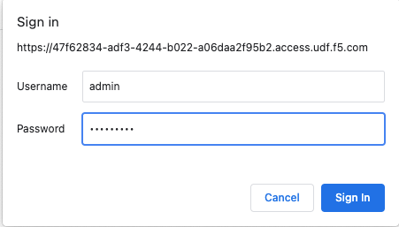
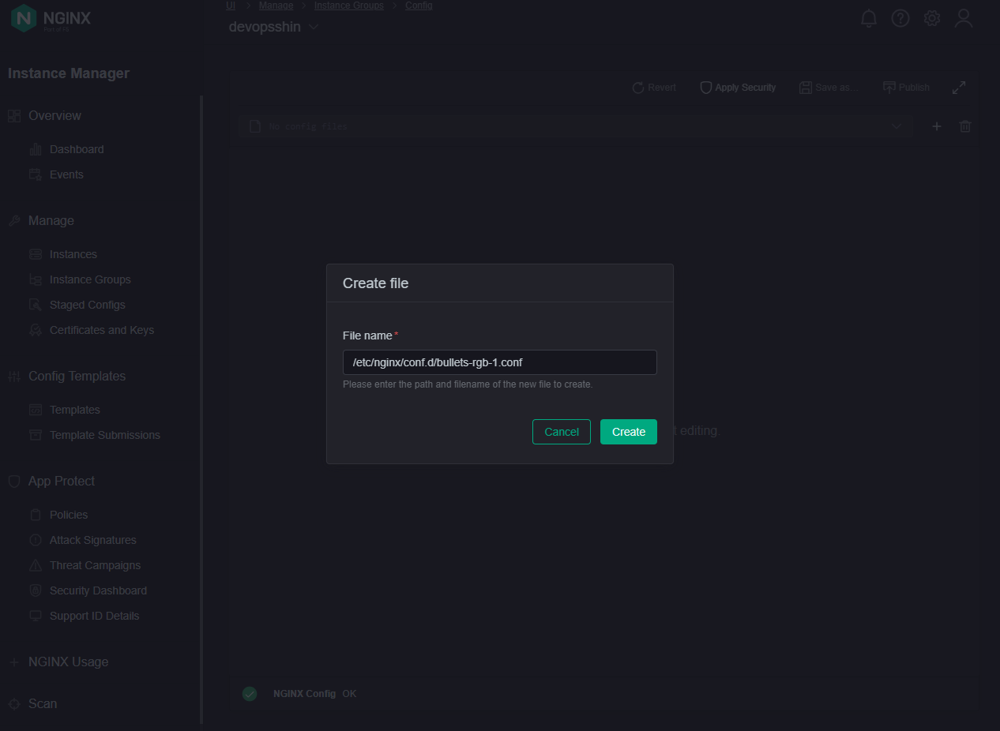
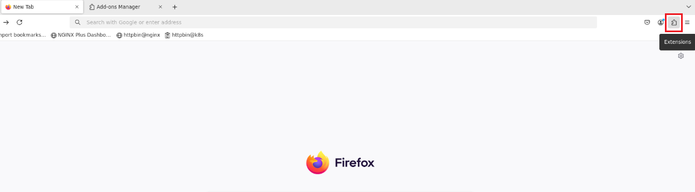
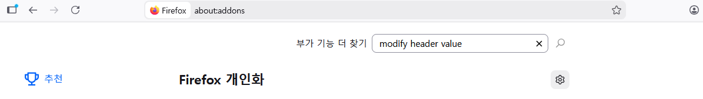
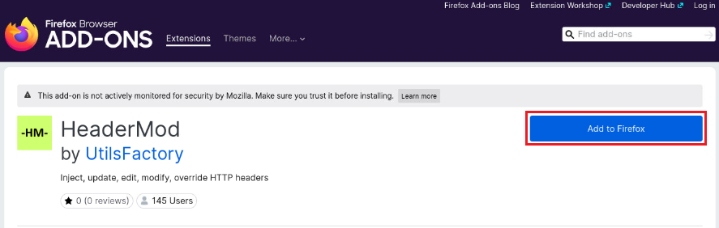
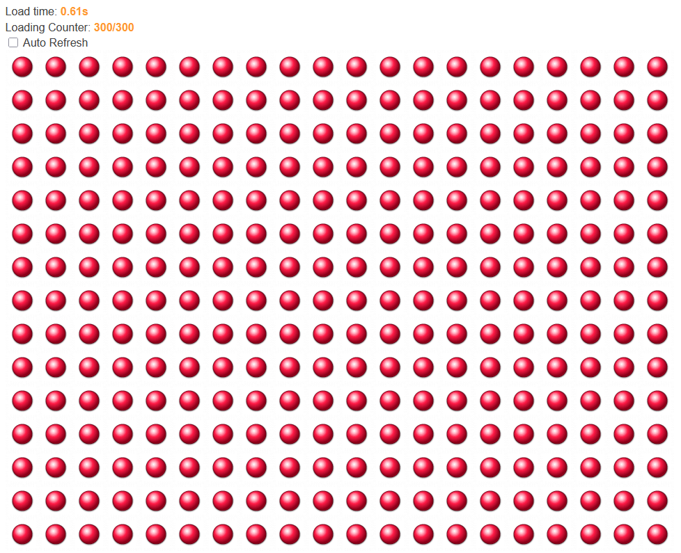
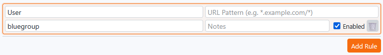
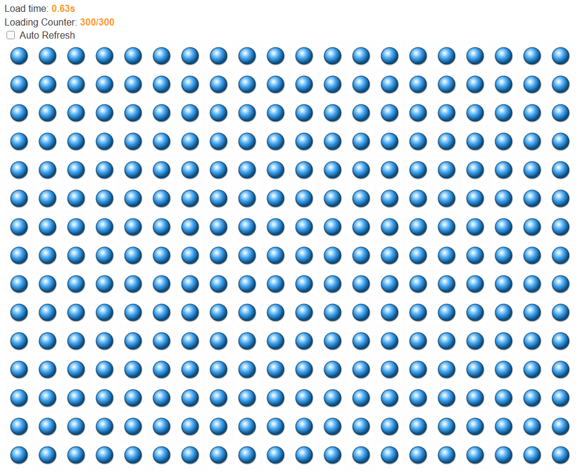
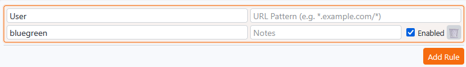
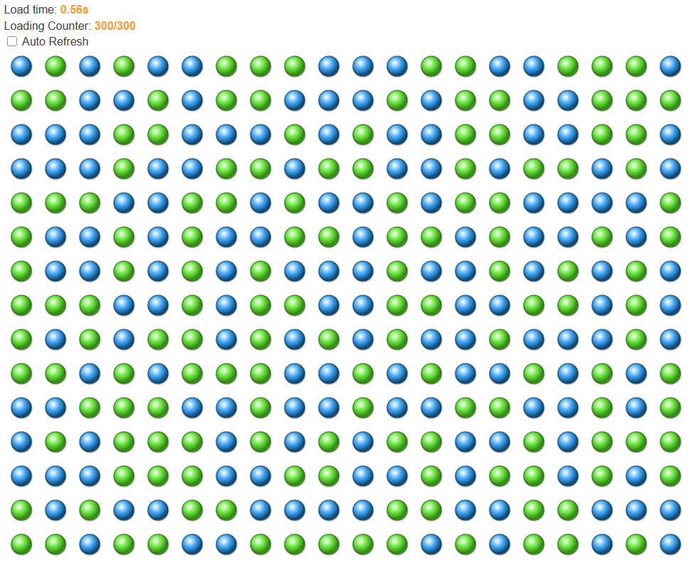

# NGINX Plus API를 활용한 블루-그린 배포 테스트

이 가이드는 **NGINX Plus** 환경에서 Blue-Green 배포 구성이 올바르게 동작하는지 검증합니다.  
HTTP 헤더 기반 트래픽 라우팅과 NGINX Plus API를 활용한 동적 가중치 점진적 전환(Gradual Rollout)을 포함합니다.

---

## 환경 개요

| 컴포넌트 | 설명 | 대상 예시 |
| --- | --- | --- |
| **NGINX Plus 게이트웨이** | `User` 헤더 값에 따라 트래픽을 라우팅 | `http://10.1.1.11` |
| **업스트림 풀** | `bluebullet`, `greenbullet`, `redbullet`, `bluegreen_bullet` | 설정 파일 참조 |
| **헤더 키** | `User` | 어느 업스트림이 요청을 처리할지 결정 |
| **API 포트** | `8080` | NGINX Plus 실시간 설정 API |

---

## 백엔드 애플리케이션 구성

이번 lab에서 사용할 redbullet, bluebullet, greenbullet 애플리케이션을 "rancher2" Kubernetes 클러스터 환경에 배포합니다.

UDF > Client-vscode > VSCODE > Terminal에서 사용 가능한 VSCode 터미널을 사용합니다.

VSCode 터미널에서 아래 명령어를 실행하여 `app-rgb-bulls-k8s-dep-svc.yaml` 파일을 사용해 클러스터에 배포합니다.

```bash
kubectl apply -f ./1.nginx-basic/basics2/app-rgb-bulls-k8s-dep-svc.yaml
```

애플리케이션 배포와 NodePort 서비스의 IP와 포트를 확인합니다.
```bash
kubectl get deployment
kubectl get services
```

## NGINX 설정 살펴보기

User 헤더 기반으로 서로 다른 업스트림으로 요청을 프록시 하는 NGINX 설정을 살펴보겠습니다.

### bullets-rgb-1.conf ###

```nginx
# 각 업스트림 풀 정의
upstream bluebullet {
    zone bluebullet 512k;
    server 10.1.20.22:32444 max_fails=1 fail_timeout=10s;
}

upstream greenbullet {
    zone greenbullet 512k;
    server 10.1.20.22:31809 max_fails=1 fail_timeout=10s;
}

upstream redbullet {
    zone redbullet 512k;
    server 10.1.20.22:31092 max_fails=1 fail_timeout=10s;
}

upstream bluegreen_bullet {
    zone bluegreen_bullet 512k;
    server 10.1.20.22:32444 max_fails=1 fail_timeout=10s;
    server 10.1.20.22:31809 max_fails=1 fail_timeout=10s;
}

# User 헤더 값에 따른 업스트림 풀 선택
map $http_user $chosen_backend {
    bluegroup  bluebullet;
    greengroup greenbullet;
    bluegreen  bluegreen_bullet;
    default    redbullet;
}

server {
    listen 80;
    listen [::]:80;
    server_name bluegreen.example.com;

    location / {
        proxy_pass http://$chosen_backend;

        proxy_connect_timeout 60s;
        proxy_read_timeout 60s;
        proxy_send_timeout 60s;

        client_max_body_size 1m;
        proxy_buffering on;
        proxy_http_version 1.1;
        proxy_set_header Upgrade $http_upgrade;
        proxy_set_header Connection "upgrade";
        proxy_set_header Host $host;
        proxy_set_header X-Real-IP $remote_addr;
        proxy_set_header X-Forwarded-For $proxy_add_x_forwarded_for;
        proxy_set_header X-Forwarded-Host $host;
        proxy_set_header X-Forwarded-Port $server_port;
        proxy_set_header X-Forwarded-Proto $scheme;

        proxy_next_upstream error timeout;
    }

    location /health {
        access_log off;
        return 200 "OK\n";
        add_header Content-Type text/plain;
    }
}
```

위 설정에는 4개의 `upstream` 블록이 정의되어 있으며, `map` 블록은 HTTP `User` 헤더 값을 기반으로 요청을 프록시할 업스트림을 결정합니다. 

각 헤더 값에 따라 선택되는 업스트림 정보는 다음과 같습니다:

| `User` 헤더 값 | 라우팅 대상 (Upstream) | 비고 |
| :--- | :--- | :--- |
| `bluegroup` | `bluebullet` | |
| `greengroup` | `greenbullet` | |
| `bluegreen` | `bluegreen_bullet` | `bluebullet`, `greenbullet` 모두 포함 |
| `default` | `redbullet` | User 헤더가 없거나 정의되지 않은 값일 경우 기본 upstream |

NIM UI에 접속하여 `bullets-rgb-1.conf` 설정을 적용합니다.

### UDF > Components > NIM > ACCESS > NIM UI

basics Lab과 동일하게, UDF 설명에 있는 사용자 이름과 비밀번호를 사용합니다.




etc/nginx/conf.d/ 디렉토리에 bullets-rgb-1.conf를 생성합니다.

NIM UI > Instance Groups > "Add File" 클릭 후 파일 경로와 이름 입력: bullets-rgb-1.conf



bullets-rgb-1.conf 파일의 내용을 붙여넣고, Publish 버튼을 클릭하면 NGINX 인스턴스에 설정이 적용됩니다.

## 1. 기본 연결 확인

각 업스트림별 기본 연결을 확인하기 위해 UDF > Docker > FIREFOX에서 Firefox 브라우저를 사용합니다.

헤더를 추가하여 요청을 전송하기 위해 Firefox 브라우저에 확장 기능을 추가합니다.



headermod 확장 기능을 검색하고 추가합니다.





### 🔴 Red (기본값) — 헤더 없이 요청

브라우저에서 다음 주소로 접속합니다: http://10.1.1.11




### 🔵 Blue 그룹으로 요청

추가한 Headermod 확장 기능을 사용하여 `User` 헤더 값을 `bluegroup`으로 설정하고, Ctrl + Shift + R을 눌러 캐시를 무시하고 브라우저를 새로고침 합니다.






### 🔵🟢 Blue-Green 혼합 요청

`User` 헤더 값을 `bluegreen`으로 수정하고, Ctrl + Shift + R을 눌러 캐시를 무시하고 브라우저를 새로고침 합니다.

  




Blue와 Green 서버로 트래픽이 분산되어 Blue, Green 이미지가 함께 표시되는 것을 확인합니다.


---

## 2. NGINX Plus API 테스트

NGINX Plus는 REST API를 통해 업스트림 설정을 조회하고 동적으로 변경할 수 있습니다.

Lab 세션1에서 구성한 `dashboard.conf`의 `/api` 경로로 NGINX Plus API를 사용합니다.

### dashboard.conf ###
```nginx
server {

    listen       8080;

    location /api {
        api write=on; # 동적 업데이트 허용
        allow all;
    }

    location / {
        root /usr/share/nginx/html;
        index   dashboard.html;
    }
}

```

UDF > Components > Nginx-plus-apigw > Access > WEB SHELL 접속 후 curl 명령어로 API를 호출합니다.

### a. API 루트 확인

```bash
curl -s http://10.1.1.11:8080/api/9/ | jq .
```

### b. 전체 업스트림 목록 조회

```bash
curl -s http://10.1.1.11:8080/api/9/http/upstreams/ | jq .
```

### c. bluegreen 업스트림 상세 조회

```bash
curl -s http://10.1.1.11:8080/api/9/http/upstreams/bluegreen_bullet/servers/ | jq .
```

업스트림 내부 서버에 할당된 `id` 값과 가중치(`weight`)를 확인합니다.

---

## 3. 점진적 전환 (동적 가중치 기반 프로모션)

NGINX Plus를 리로드하지 않고 API를 통해 blue → green으로 실시간 트래픽 비율을 조정할 수 있습니다.

먼저 기존에 구성한 설정의 `bluegreen_bullet` 업스트림을 NIM에서 아래와 같이 변경합니다.

기존 업스트림 구성에서 blue 서버의 `weight` 값을 99, green 서버의 `weight` 값을 1로 변경합니다.

### bulls-rgb-1-w2.conf ###
```nginx
......

#### 기존 설정
#upstream bluegreen_bullet {
#    zone bluegreen_bullet 512k;
#    server 10.1.20.22:32444 max_fails=1 fail_timeout=10s;
#    server 10.1.20.22:31809 max_fails=1 fail_timeout=10s;
#}

#### 변경 설정
upstream bluegreen_bullet {
    zone bluegreen_bullet 512k;
    server 10.1.20.22:32444 weight=99;
    server 10.1.20.22:31809 weight=1;
}

###

......
```

Firefox 브라우저에서 Ctrl + Shift + R을 눌러 브라우저를 새로고침 하면, 적용된 `weight` 비율에 따라 blue와 green 이미지가 표시되는 것을 확인할 수 있습니다.

### a: 50/50 비율로 전환 (Gradual Rollout)

NGINX Plus API를 사용하여 Blue 서버와 Green 서버의 가중치를 50으로 변경하고, 브라우저를 새로고침하여 결과를 확인합니다.

```bash
curl -X PATCH -d '{"weight":50}' http://10.1.1.11:8080/api/9/http/upstreams/bluegreen_bullet/servers/0
curl -X PATCH -d '{"weight":50}' http://10.1.1.11:8080/api/9/http/upstreams/bluegreen_bullet/servers/1
```

### b: 20/80 비율로 전환 (Gradual Rollout)

NGINX Plus API를 사용하여 Blue 서버의 가중치를 20으로 줄이고 Green 서버의 가중치를 80으로 높인 후, 브라우저를 새로고침하여 결과를 확인합니다.

```bash
curl -X PATCH -d '{"weight":20}' http://10.1.1.11:8080/api/9/http/upstreams/bluegreen_bullet/servers/0
curl -X PATCH -d '{"weight":80}' http://10.1.1.11:8080/api/9/http/upstreams/bluegreen_bullet/servers/1
```

### c: Green 100% 전환 (완전 프로모션)

NGINX에서 `weight` 값은 1 이상이어야 하므로 0으로 설정할 수 없습니다. 

트래픽 유입 제어를 위해 `down` 또는 `drain` 속성을 사용합니다. `drain`을 설정하면 새로운 요청은 받지 않되, 기존 세션이 유지되어 해당 서버에 연결되어 있는 사용자들의 요청은 완료될 때까지 계속 처리해 줍니다. 

Blue 서버를 drain하고, Green 서버의 가중치를 100으로 높인 후, 브라우저를 새로고침하여 결과를 확인합니다.

```bash
# Blue (servers/0) 서버로 가는 새로운 트래픽을 차단하고 기존 연결이 끝나기를 대기
curl -X PATCH -d '{"drain":true}'  http://10.1.1.11:8080/api/9/http/upstreams/bluegreen_bullet/servers/0
# Green (servers/1) 서버의 가중치를 100으로 설정
curl -X PATCH -d '{"weight":100}' http://10.1.1.11:8080/api/9/http/upstreams/bluegreen_bullet/servers/1
```

### 변경된 업스트림 상태 확인

```bash
curl -s http://10.1.1.11:8080/api/9/http/upstreams/bluegreen_bullet/servers/ | jq '.[] | {server,weight,drain}'
```

업스트림 내부 서버에 할당된 id 값과 가중치(weight), drain 상태를 확인합니다.

---

## 4. 롤백 절차 (즉시 복구)

완전 프로모션 시 `drain` 처리했던 Blue 서버를 `down` 처리 후 해제하여 활성화 하고, 가중치를 되돌립니다.

```bash
curl -X PATCH -d '{"down": true}' http://10.1.1.11:8080/api/9/http/upstreams/bluegreen_bullet/servers/0
curl -X PATCH -d '{"down": false}' http://10.1.1.11:8080/api/9/http/upstreams/bluegreen_bullet/servers/0
curl -X PATCH -d '{"weight":99}' http://10.1.1.11:8080/api/9/http/upstreams/bluegreen_bullet/servers/0
curl -X PATCH -d '{"weight":1}' http://10.1.1.11:8080/api/9/http/upstreams/bluegreen_bullet/servers/1
```

### 롤백 결과 확인

```bash
curl -s http://10.1.1.11:8080/api/9/http/upstreams/bluegreen_bullet/servers/ | jq '.[] | {server,weight,drain}'
```

파이어폭스 브라우저에서 Ctrl + Shift + R을 눌러 브라우저를 새로고침 하여 결과를 확인합니다.

---

## 💡 참고
지금까지 NGINX Plus API를 사용하여 동적으로 처리한 가중치(`weight`) 변경이나 서버 상태(`down`, `drain`) 등은 메모리 상에만 적용됩니다. 

따라서 NGINX 인스턴스를 재시작하거나 설정 파일을 리로드(`nginx -s reload`)하게 되면, API로 변경했던 모든 상태가 초기화되고 .conf 파일에 작성된 원본 설정(Blue 99, Green 1)으로 되돌아갑니다.

API를 통해 동적으로 변경한 상태를 리로드 후에도 계속 유지하고 싶다면, NGINX 설정 파일의 `upstream` 블록 내에 `state` 지시문을 사용하여 서버 상태를 특정 파일에 저장하도록 구성해야 합니다.

`state` 지시문 적용 예시:
```nginx
upstream bluegreen_bullet {
    zone bluegreen_bullet 512k;
    state /var/lib/nginx/state/bluegreen_bullet.conf;
}
```

**주의**: `state` 지시문은 `server` 지시문 함께 사용할 수 없습니다. 따라서 이를 적용하려면 기존 설정 파일 내에 명시된 server 목록을 모두 지우고, NGINX 구동 후 API를 통해서만 서버를 추가/관리하는 방식을 취해야 합니다

## LAB 세션 2 종료 ##
