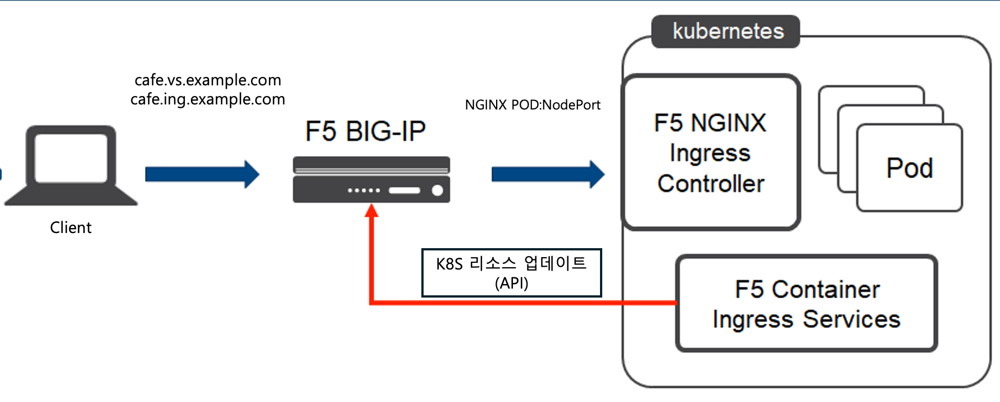
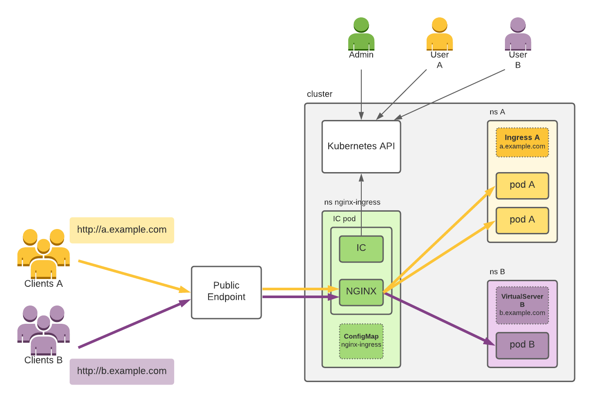
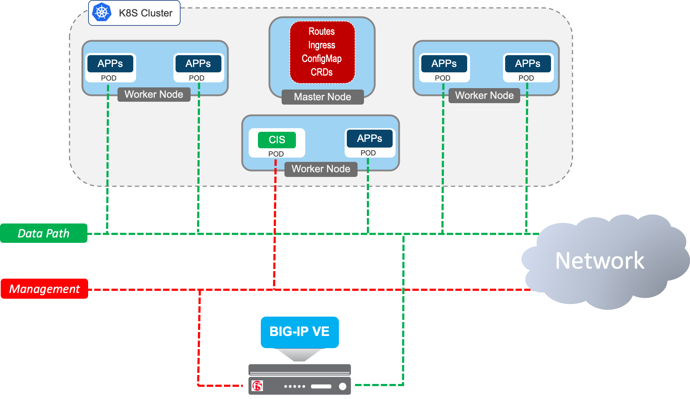
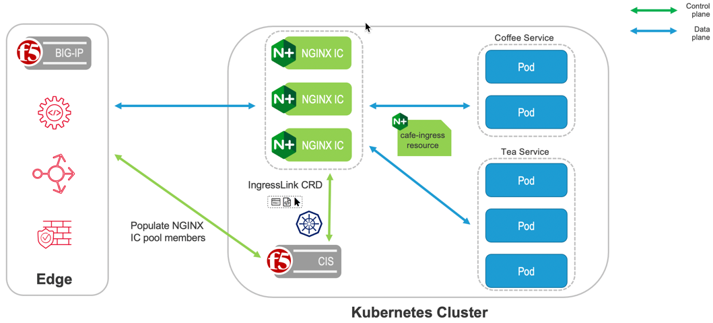

## F5 NGINX Ingress Controller With F5 CIS 

본 과정에서는 F5 NGINX Ingress Controller 와 더불어 F5 BIG-IP 장비와 NGINX 를 연동하여 구성할 수 있는
F5 CIS 에 대해서 소개하겠습니다.

---
### Lab 구성도

---

## F5 NGINX Ingress Controller 
> 원본 아키텍처 문서: https://docs.nginx.com/nginx-ingress-controller/overview/design/

NGINX 인그레스 컨트롤러는 NGINX와 NGINX Plus를 위한 인그레스 컨트롤러 구현체로, Websocket, gRPC, TCP, UDP 애플리케이션을 로드 밸런스할 수 있습니다. NGINX Ingress Controller는 Kubernetes API를 통해 NGINX를 관리할 수 있는 방법을 제공하며, Kubernetes 환경에서 발생하는 지속적인 변화를 처리할 수 있도록 설계되었습니다.

콘텐츠 기반 라우팅과 TLS/SSL 종단 같은 표준 인그레스 기능을 지원합니다. 여러 NGINX 및 NGINX Plus의 기능은 Annotations와 ConfigMap 리소스를 통해 Ingress 리소스의 확장으로 제공됩니다.

NGINX Ingress 컨트롤러는 Ingress의 대안으로 VirtualServer와 VirtualServerRoute 자원을 지원하여 트래픽 분할과 고급 콘텐츠 기반 라우팅을 가능하게 합니다. 또한 TransportServer 자원을 이용한 TCP, UDP, TLS 패스스루 부하 분산도 지원합니다.

다음 이미지는 NGINX Ingress Controller 의 구성  기본 예시 입니다. 

 

### NGINX Plus 사용시 추가 지원 기능 

NGINX Ingress Controller 는 NGINX OSS 및 NGINX Plus 를 모두 지원합니다. NGINX Plus 를 사용할 경우 다음과 같은 추가 기능을 활용할 수 있습니다.

* 실시간 지표: NGINX Plus와 애플리케이션 성능에 대한 지표는 API 또는 NGINX 상태 페이지를 통해 제공됩니다. 이 지표들은 Prometheus로도 내보낼 수 있습니다.
* 추가 부하 분산 메소드 제공 : least_time / random two least_time 알고리즘에 대해서 활용 가능 
* 세션 지속성: 스티키 쿠키 메서드가 제공됩니다. Ingress Resource 및 Custom Resource 에서 구성하여 활용 가능
* Active Health Check : Backend 서비스에 대해 능동적으로 헬스체크 가능, 다양한 Health Check Method 활용 가능  
* JWT 검증: JWT Token 에 대해 Validation 지원
* 동적 재설정 : Backend 서비스 변경시 NGINX reload 없이 NGINX Update 가 가능 

 

---
 

## F5 CIS (Container Ingress Service)

F5 CIS(Container Ingress Services)는 Kubernetes와 OpenShift 환경에서 BIG-IP와 NGINX를 연동해 Ingress, Load Balancing, 보안 정책 구성을 자동화해주는 컨트롤러입니다.
애플리케이션 서비스 배포를 단순화하고, 운영자가 수동으로 네트워크 설정을 반복하지 않아도 되도록 도와줍니다.
이를 통해 컨테이너 환경에서도 일관된 트래픽 관리와 안정적인 애플리케이션 제공이 가능합니다.
다양한 CNI 와 통합 (Calico/Cilium) 을 통한 F5 BIG-IP 와의 원활산 서비스 제공도 가능합니다. 

 

### F5 CIS 에서 제공되는 서비스 유형

* configmap
* route (openshift)
* Ingress
* Loadbalancer 
* IngressLink
* IPAM Controller 
* CRD
  - Virtual Server
  - TLSProfile
  - Transport Server
  - External DNS
  - Policy 

 

### Ingress Link 

IngressLink는 F5 컨테이너 인그레스 서비스와 NGINX 인그레스 서비스를 사용하여 BIG-IP와 NGINX 간에 정의된 자원 정의입니다.

F5 IngressLink는 BIG-IP와 NGINX 기술이 처음으로 진정한 통합을 시도한 사례입니다. 
F5 IngressLink는 BIG-IP 컨테이너 인그레스 서비스와 Kubernetes용 NGINX Ingress 컨트롤러를 모두 사용하는 현대적인 컨테이너 애플리케이션 워크로드를 지원하기 위해 구축되었습니다. 
이 솔루션은 두 기술을 단일 인터페이스에서 통합적으로 활용할 수 있는 우아한 컨트롤 플레인 솔루션으로, BIG-IP와 NGINX의 장점을 제공하고 NetOps와 DevOps 팀 간의 협업을 촉진합니다. 
아래의 그림과 같이 서비스가 동작하는 것을 확인할 수 있습니다. 

---

 

## Lab 배포 
실습은 아래의 단계로 진행됩니다. 
사용자의 실습 경험 향상을 위해 CIS 및 NIC 를 동시에 배포하는 환경으로 진행됩니다. 

 

### 1. CIS Deploy 
[F5 CIS Deploy](/1-CIS/README.md)을 참고하세요.

### 2. NGINX Ingress Controller & SVC Deploy 
[NGINX Ingress Controller](/2-NIC/README.md)을 참고하세요.