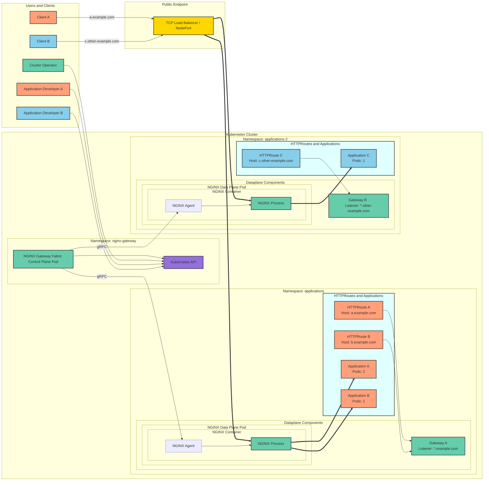
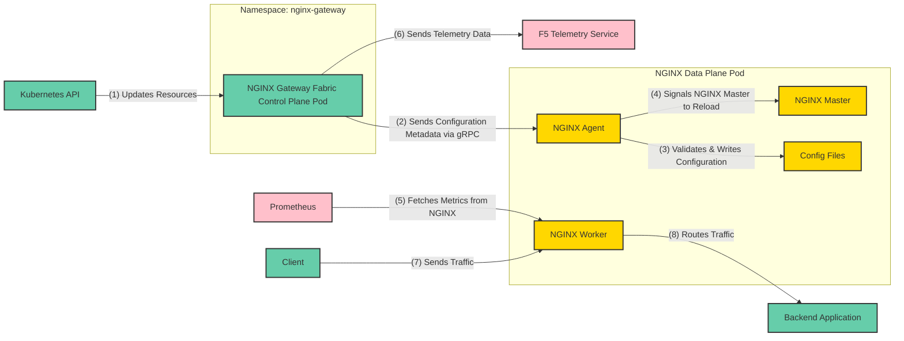

# NGINX Gateway Fabric 배포 가이드

> 원본 아키텍처 문서: [https://docs.nginx.com/nginx-gateway-fabric/overview/gateway-architecture/](https://docs.nginx.com/nginx-gateway-fabric/overview/gateway-architecture/)

---

## NGINX Gateway Fabric 아키텍처

NGINX Gateway Fabric은 NGINX를 데이터 플레인으로 사용하는 Kubernetes Gateway API 구현체입니다.
이 섹션은 운영 환경에서 NGINX Gateway Fabric이 어떻게 동작하는지 이해하고자 하는 **클러스터 운영자**와, 애플리케이션 트래픽 노출 및 라우팅에 NGF를 활용하려는 **애플리케이션 개발자**를 위해 작성되었습니다.

---

### 배포 모델 및 아키텍처 개요

NGINX Gateway Fabric은 보안, 유연성, 안정성을 높이기 위해 아키텍처를 두 가지 핵심 영역으로 분리합니다.

#### 컨트롤 플레인: 중앙 집중식 관리

컨트롤 플레인은 Deployment로 운영되며, [controller-runtime](https://github.com/kubernetes-sigs/controller-runtime) 라이브러리로 구축된 Kubernetes 컨트롤러 역할을 합니다. Gateway API 리소스와 Services, Endpoints, Secrets 등 Kubernetes 오브젝트를 감시하여 NGINX 데이터 플레인의 리소스 프로비저닝 및 설정을 관리합니다.

주요 기능:

- **동적 프로비저닝**: 새로운 Gateway 리소스가 생성되면, 컨트롤 플레인이 전용 NGINX Deployment를 자동으로 프로비저닝하고 Service를 통해 노출합니다.
- **설정 관리**: Kubernetes 및 Gateway API 리소스를 NGINX 설정으로 변환하고, gRPC 연결을 통해 NGINX Agent로 안전하게 전달합니다.
- **보안 통신**: gRPC 연결은 기본적으로 설치 시 생성된 자체 서명 인증서를 사용하며, 선택적으로 [cert-manager](https://cert-manager.io/) 연동도 지원합니다.

#### 데이터 플레인: 자율적 트래픽 관리

각 NGINX 데이터 플레인 Pod는 독립적인 Deployment 또는 DaemonSet으로 프로비저닝되며, `nginx` 컨테이너를 포함합니다. 이 컨테이너는 `nginx` 프로세스와 [NGINX Agent](https://github.com/nginx/agent)를 함께 실행합니다.

- **설정 적용**: Agent는 컨트롤 플레인으로부터 업데이트를 수신하여 NGINX 인스턴스에 적용합니다.
- **재로드 처리**: NGINX Agent가 설정 조정 및 NGINX 재로드를 담당하므로, 컨트롤 플레인과 데이터 플레인 Pod 간에 공유 볼륨이나 Unix 시그널이 필요하지 않습니다.

#### Gateway 리소스 관리

동일한 클러스터 내에서 여러 Gateway를 동시에 운영할 수 있습니다.

- **동시 Gateway 운영**: 단일 설치 환경 내에서 여러 Gateway 오브젝트가 동시에 실행될 수 있습니다.
- **1:1 리소스 매핑**: 각 Gateway 리소스는 전용 데이터 플레인 Deployment와 1:1로 대응되어, 명확한 소유권 분리와 운영 격리를 보장합니다.

---

### 실행 환경 전체 구조 개요

아래 그림은 Kubernetes 클러스터 내에서 NGINX Gateway Fabric이 인터넷의 클라이언트에게 세 가지 웹 애플리케이션을 노출하는 예시를 보여줍니다.



> 이 그림에는 클러스터 운영자 및 애플리케이션 개발자가 생성해야 하는 Deployment, Service 등의 필수 Kubernetes 리소스가 일부 생략되어 있습니다.

| **구분**                    | **설명**                                                                                                                                                                                                                                                                                                                                          |
| --------------------------------- | ------------------------------------------------------------------------------------------------------------------------------------------------------------------------------------------------------------------------------------------------------------------------------------------------------------------------------------------------------- |
| **네임스페이스**            | -*nginx-gateway*: NGINX Gateway Fabric 컨트롤 플레인 Pod가 위치하며, Gateway API 설정 관리 및 NGINX 데이터 플레인 Pod 프로비저닝을 담당합니다. - *applications*: `*.example.com`에 대한 Gateway A가 위치하며 Application A, B를 처리합니다. - *applications-2*: `*.other-example.com`에 대한 Gateway B가 위치하며 Application C를 처리합니다. |
| **사용자**                  | -*클러스터 운영자*: NGINX Gateway Fabric 컨트롤 플레인 Pod를 구성하고 Gateway A, B를 프로비저닝하여 Gateway API 리소스를 관리합니다. - *개발자 A & B*: 애플리케이션을 배포하고 각 Gateway에 연결된 HTTPRoute를 생성합니다.                                                                                                                          |
| **클라이언트**              | -*Client A*: `a.example.com`을 통해 Application A와 통신합니다. - *Client B*: `c.other-example.com`을 통해 Application C와 통신합니다.                                                                                                                                                                                                          |
| **컨트롤 플레인 Pod**       | `nginx-gateway` 네임스페이스에 배포되며, Kubernetes API와 통신하여 Gateway API 리소스를 가져오고, NGINX 데이터 플레인 Pod를 동적으로 프로비저닝하고, gRPC를 통해 NGINX Agent에 라우팅 설정을 전달합니다.                                                                                                                                              |
| **Gateway**                 | -*Gateway A*: `*.example.com` 하위 요청을 수신합니다. HTTPRoute A → Application A, HTTPRoute B → Application B로 라우팅합니다. - *Gateway B*: `*.other-example.com` 하위 요청을 수신합니다. HTTPRoute C → Application C로 라우팅합니다.                                                                                                      |
| **애플리케이션**            | -*Application A*: 개발자 A가 배포 (2 pods), Gateway A의 HTTPRoute A를 통해 라우팅됩니다. - *Application B*: 개발자 A가 배포 (1 pod), Gateway A의 HTTPRoute B를 통해 라우팅됩니다. - *Application C*: 개발자 B가 배포 (1 pod), Gateway B의 HTTPRoute C를 통해 라우팅됩니다.                                                                        |
| **NGINX 데이터 플레인 Pod** | -*Pod A*: Gateway A로부터 트래픽을 처리하며, NGINX Process A가 Application A/B로 요청을 전달하고 NGINX Agent A가 gRPC를 통해 설정 업데이트를 수신합니다. - *Pod B*: Gateway B로부터 트래픽을 처리하며, NGINX Process B가 Application C로 요청을 전달하고 NGINX Agent B가 gRPC를 통해 설정 업데이트를 수신합니다.                                    |
| **트래픽 흐름**             | -*Client A*: `a.example.com` → 퍼블릭 엔드포인트 → Gateway A → NGINX Process A → Application A - *Client B*: `c.other-example.com` → 퍼블릭 엔드포인트 → Gateway B → NGINX Process B → Application C                                                                                                                                    |
| **퍼블릭 엔드포인트**       | TCP Load Balancer 또는 NodePort로, NGINX 데이터 플레인을 외부에 노출하여 클라이언트 트래픽을 클러스터 내부로 전달하는 공유 진입점입니다.                                                                                                                                                                                                                |
| **Kubernetes API**          | 리소스 관리의 중심 허브로, Gateway A/B에 대한 Gateway API 리소스를 가져오고 컨트롤 플레인 Pod를 통한 NGINX 설정 업데이트를 조율합니다.                                                                                                                                                                                                                  |

**색상 구분:**

- 🟢 **초록**: 클러스터 운영자 리소스 (NGINX Gateway Fabric, NGINX Pod, Gateway 등)
- 🟠 **주황**: 애플리케이션 개발자 A 소유 리소스 (HTTPRoute A, Application A 등)
- 🔵 **파랑**: 애플리케이션 개발자 B 소유 리소스 (HTTPRoute C, Application C 등)

---

### 컴포넌트 통신 워크플로우



| # | 컴포넌트 / 프로토콜    | 설명                                                                                                                                                                                                             |
| - | ---------------------- | ---------------------------------------------------------------------------------------------------------------------------------------------------------------------------------------------------------------- |
| 1 | Kubernetes API (HTTPS) | *Kubernetes API → 컨트롤 플레인 Pod*: 컨트롤 플레인 Pod가 Kubernetes API를 감시하여 Gateway, HTTPRoute 등 Gateway API 리소스의 업데이트를 수신하고 최신 설정을 가져와 라우팅 및 트래픽 제어를 관리합니다.     |
| 2 | gRPC                   | *컨트롤 플레인 Pod → NGINX Agent*: 컨트롤 플레인 Pod가 Gateway API 리소스를 처리하여 NGINX 설정을 생성하고, gRPC를 통해 데이터 플레인 Pod 내 NGINX Agent에 안전하게 전달합니다.                               |
| 3 | File I/O               | *NGINX Agent → Config Files*: NGINX Agent가 컨트롤 플레인으로부터 수신한 설정 메타데이터를 검증하고 Pod 내 NGINX 설정 파일에 기록합니다. 이 파일에는 동적 라우팅 규칙과 트래픽 설정이 저장됩니다.             |
| 4 | Signal                 | *NGINX Agent → NGINX Master*: 설정 파일 기록 후, NGINX Agent가 NGINX Master 프로세스에 설정 재로드 시그널을 전송합니다. 이를 통해 업데이트된 라우팅 규칙이 즉시 적용됩니다.                                   |
| 5 | HTTP/HTTPS             | *Prometheus → NGINX Worker*: Prometheus가 NGINX Worker 프로세스의 `/metrics` 엔드포인트에서 트래픽 통계, 요청 처리율, 활성 연결 수 등 런타임 메트릭을 수집합니다.                                           |
| 6 | HTTPS                  | *컨트롤 플레인 Pod → F5 Telemetry Service*: 컨트롤 플레인 Pod가 API 요청 처리량, 사용량 메트릭, 성능 통계, 오류율 등의 텔레메트리 데이터를 외부 F5 Telemetry Service로 전송합니다.                            |
| 7 | HTTP/HTTPS             | *Client → NGINX Worker*: 클라이언트가 HTTP/HTTPS 요청을 NGINX Worker 프로세스로 전송합니다. 요청은 일반적으로 공유 퍼블릭 엔드포인트(LoadBalancer 또는 NodePort)를 경유하여 NGINX 데이터 플레인에 도달합니다. |
| 8 | HTTP/HTTPS             | *NGINX Worker → Backend Application*: NGINX Worker 프로세스가 컨트롤 플레인으로부터 수신한 라우팅 규칙에 따라 클라이언트 트래픽을 적절한 백엔드 애플리케이션 서비스(Pod)로 전달합니다.                        |

#### NGINX Plus 사용 시 추가 기능

NGINX Gateway Fabric은 NGINX OSS와 NGINX Plus를 모두 지원합니다. NGINX Plus를 사용할 경우 다음과 같은 추가 기능을 활용할 수 있습니다.

- 관리자가 포트 8765에서 NGINX Plus API에 연결 가능 (기본적으로 localhost로 제한)
- [NGINX Plus API](http://nginx.org/en/docs/http/ngx_http_api_module.html)를 사용하여 전체 재로드 없이 업스트림 서버를 동적으로 업데이트 가능
  - 애플리케이션 스케일링(Pod 추가/제거) 시에도 설정 재로드 빈도가 줄어들어 업데이트 중 잠재적 중단을 최소화하고 시스템 안정성을 향상

#### 장애 격리 및 복원력

컨트롤 플레인과 데이터 플레인을 분리함으로써 명확한 운영 경계가 형성되어 복원력과 장애 격리가 향상됩니다.

**컨트롤 플레인 장애 시:**

- 기존 데이터 플레인 Pod는 마지막으로 캐시된 유효한 설정을 사용하여 트래픽 서비스를 계속 제공합니다.
- 라우팅이나 Gateway 업데이트는 일시적으로 중단되지만, 안정적인 트래픽 전달은 유지됩니다.
- 복구 후에는 설정 업데이트가 원활하게 재동기화됩니다.

**데이터 플레인 장애 시:**

- 해당 Gateway 오브젝트와 연결된 라우팅에만 일시적인 영향이 발생합니다.
- Pod 재시작 후 자동으로 설정이 재동기화되어 영향 범위가 최소화됩니다.
- 다른 데이터 플레인 Pod는 영향을 받지 않고 정상 서비스를 유지합니다.

#### Pod 준비 상태 (Readiness)

컨트롤 플레인(`nginx-gateway`)과 데이터 플레인(`nginx`) 컨테이너는 `/readyz` 엔드포인트를 통해 준비 상태를 제공합니다. [Readiness Probe](https://kubernetes.io/docs/tasks/configure-pod-container/configure-liveness-readiness-startup-probes/#define-readiness-probes)가 시작 시 이 엔드포인트를 주기적으로 점검하며, 다음 조건이 충족될 때 `200 OK`를 반환합니다.

- 컨트롤 플레인이 NGINX 데이터 플레인을 설정할 준비가 된 경우
- 데이터 플레인이 트래픽을 처리할 준비가 된 경우

이를 통해 정상 상태의 Pod에만 트래픽이 라우팅되어 안정적인 시작과 운영이 보장됩니다.

---

## 랩 배포

[사전 요구사항](/README.md#getting-started)을 참고하세요.

## 설치

> **주의: 공개 리포지토리의 라이센스 문제로 인해 1번~4번까지의 과정은 이미 Kubernetes에 적용이 되어 있기 때문에 따로 수행할 필요가 없습니다. 5번 CRD 배포부터 Lab을 진행하시면 됩니다.**

### 1. NGINX Gateway Fabric 네임스페이스 생성

```code
kubectl create namespace nginx-gateway
```

### 2. NGINX 프라이빗 레지스트리에서 이미지를 가져오기 위한 Kubernetes 시크릿 생성

```code
kubectl create secret docker-registry nginx-plus-registry-secret --docker-server=private-registry.nginx.com --docker-username=`cat <nginx-one-eval.jwt>` --docker-password=none -n nginx-gateway
```

> **참고:** `<nginx-one-eval.jwt>` 는 `nginx-one-eval.jwt` 파일의 경로 및 파일명입니다.

### 3. NGINX Plus 라이선스를 담은 Kubernetes 시크릿 생성

```code
kubectl create secret generic nplus-license --from-file license.jwt=<nginx-one-eval.jwt> -n nginx-gateway
```

> **참고:** `<nginx-one-eval.jwt>` 는 `nginx-one-eval.jwt` 파일의 경로 및 파일명입니다.

### 4. 사용 가능한 NGINX Gateway Fabric 도커 이미지 목록 확인

```code
curl -s https://private-registry.nginx.com/v2/nginx-gateway-fabric/nginx-plus/tags/list --key <nginx-one-eval.key> --cert <nginx-one-eval.crt> | jq
```

> **참고:** `<nginx-one-eval.key>` 와 `<nginx-one-eval.crt>` 는 각각 해당 파일의 경로 및 파일명입니다.

최신 버전을 선택하세요 (작성 시점 기준 최신 버전: `2.4.2`)

### 5. NGINX Gateway Fabric 커스텀 리소스 적용 (`ref=` 에 최신 버전을 지정하세요)

```code
kubectl kustomize "https://github.com/nginx/nginx-gateway-fabric/config/crd/gateway-api/standard?ref=v2.4.2" | kubectl apply -f -
```

### 6. Helm 차트를 통해 NGINX Gateway Fabric 설치 (`nginx.image.tag` 에 최신 버전을 지정하세요)

```code
helm install ngf oci://ghcr.io/nginx/charts/nginx-gateway-fabric \
  --set nginx.image.repository=private-registry.nginx.com/nginx-gateway-fabric/nginx-plus \
  --set nginx.image.tag=2.4.2 \
  --set nginx.plus=true \
  --set serviceAccount.imagePullSecret=nginx-plus-registry-secret \
  --set nginx.imagePullSecret=nginx-plus-registry-secret \
  --set nginx.usage.secretName=nplus-license \
  --set nginx.service.type=NodePort \
  --set nginxGateway.snippets.enable=true \
  -n nginx-gateway
```

### 7. NGINX Gateway Fabric Pod 상태 확인

```code
kubectl get pods -n nginx-gateway
```

Pod 이 `Running` 상태여야 합니다.

```code
NAME                                            READY   STATUS      RESTARTS   AGE
ngf-nginx-gateway-fabric-78658c6d47-bv6pb       1/1     Running     0          15s
```

### 8. NGINX Gateway Fabric 로그 확인

```code
kubectl logs -l app.kubernetes.io/instance=ngf -n nginx-gateway -c nginx-gateway
```

출력 결과는 아래와 유사해야 합니다.

```code
{"level":"info","ts":"2026-03-02T13:35:54Z","msg":"Starting the NGINX Gateway Fabric control plane","version":"2.4.2","commit":"44b3320a430bedf23d96ba1e7c86577fba304e68","date":"2026-02-18T19:49:50Z","dirty":"true"}
{"level":"info","ts":"2026-03-02T13:35:54Z","msg":"Starting manager"}
{"level":"info","ts":"2026-03-02T13:35:54Z","logger":"controller-runtime.metrics","msg":"Starting metrics server"}
{"level":"info","ts":"2026-03-02T13:35:54Z","msg":"starting server","name":"health probe","addr":"[::]:8081"}
{"level":"info","ts":"2026-03-02T13:35:54Z","logger":"controller-runtime.metrics","msg":"Serving metrics server","bindAddress":":9113","secure":false}
{"level":"info","ts":"2026-03-02T13:35:54Z","msg":"Attempting to acquire leader lease...","lock":"nginx-gateway/ngf-nginx-gateway-fabric-leader-election"}
{"level":"info","ts":"2026-03-02T13:35:54Z","msg":"Successfully acquired lease","lock":"nginx-gateway/ngf-nginx-gateway-fabric-leader-election"}
{"level":"info","ts":"2026-03-02T13:35:54Z","logger":"telemetryJob","msg":"Starting cronjob"}
{"level":"info","ts":"2026-03-02T13:35:54Z","logger":"eventLoop.eventHandler","msg":"Reconfigured control plane.","batchID":59}
```

### 9. Kubernetes 서비스 상태 확인

```code
kubectl get svc -n nginx-gateway
```

NGINX Gateway Fabric 컨트롤 플레인은 TCP 포트 443에서 수신 대기해야 합니다.

```code
NAME                       TYPE        CLUSTER-IP     EXTERNAL-IP   PORT(S)   AGE
ngf-nginx-gateway-fabric   ClusterIP   10.99.80.168   <none>        443/TCP   39s
```

### 10. `gatewayclass` 확인

```code
kubectl get gatewayclass
```

`nginx` gatewayclass 가 정상적으로 허용(Accepted)되어야 합니다.

```code
NAME    CONTROLLER                                   ACCEPTED   AGE
nginx   gateway.nginx.org/nginx-gateway-controller   True       49s
```

---

## 제거 (Uninstalling)

### 1. Helm 차트를 통해 NGINX Gateway Fabric 제거

```code
helm uninstall ngf -n nginx-gateway
```

### 2. 네임스페이스 삭제

```code
kubectl delete namespace nginx-gateway
```

### 3. 모든 CRD 제거

```code
kubectl delete -f https://raw.githubusercontent.com/nginx/nginx-gateway-fabric/v2.4.2/deploy/crds.yaml
```

### 4. Gateway API 리소스 제거

```code
kubectl kustomize "https://github.com/nginx/nginx-gateway-fabric/config/crd/gateway-api/standard?ref=v2.4.2" | kubectl delete -f -
```
