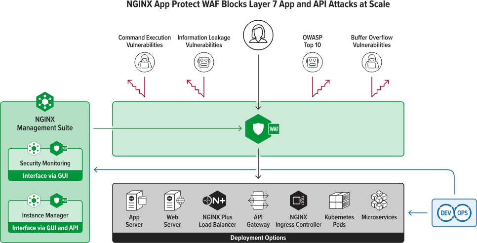
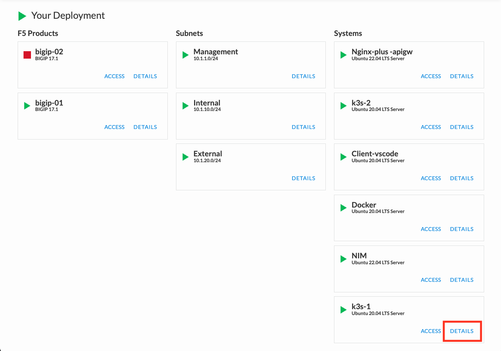
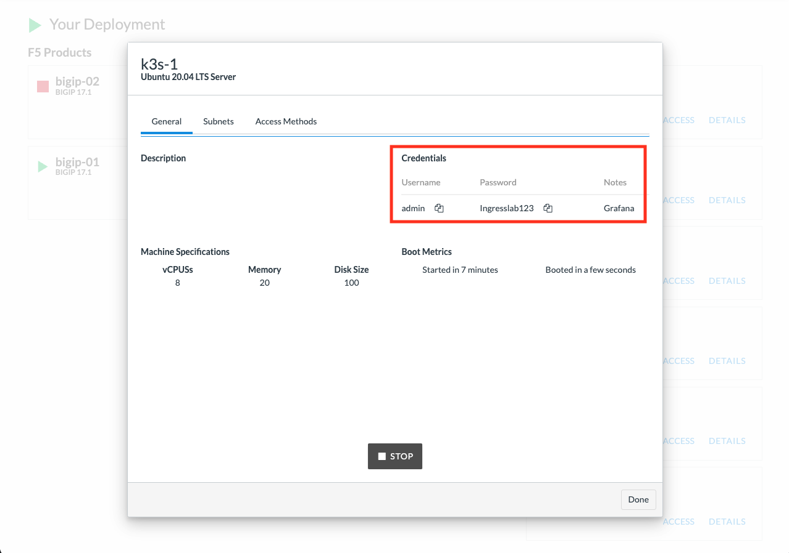
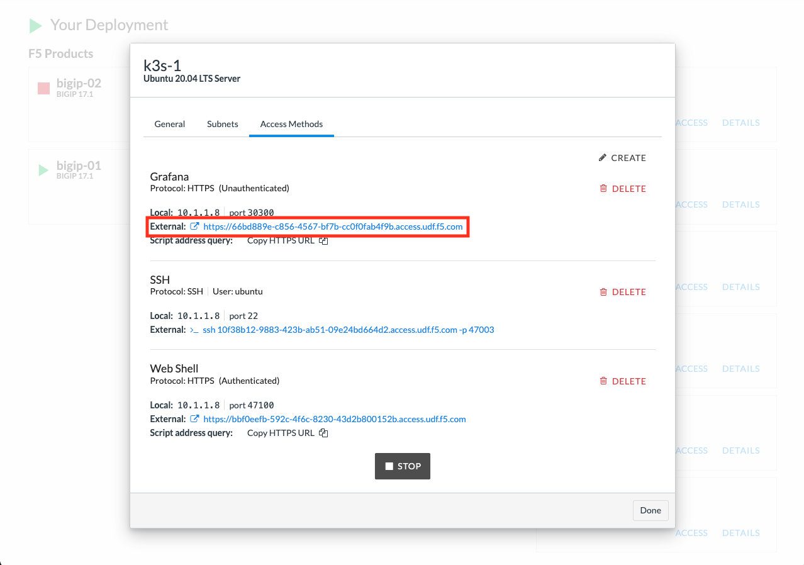
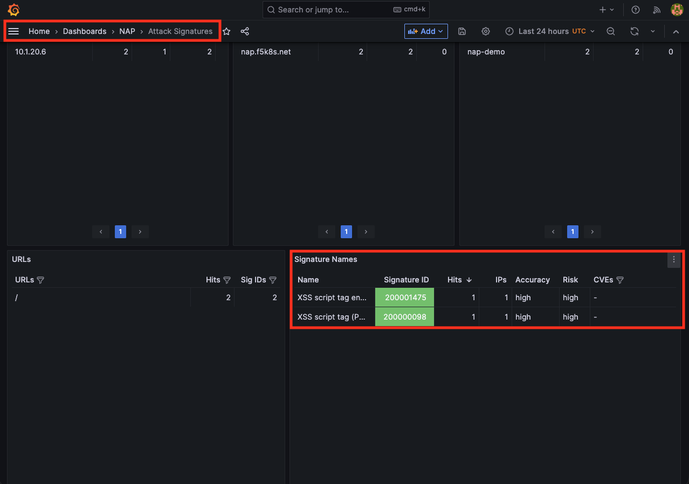
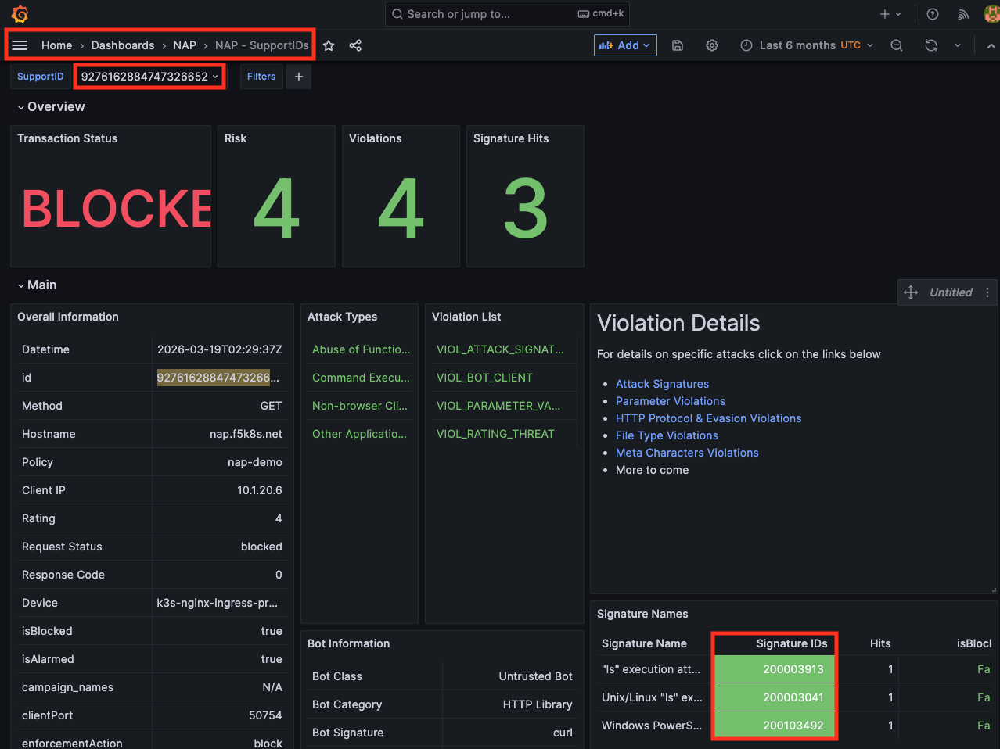
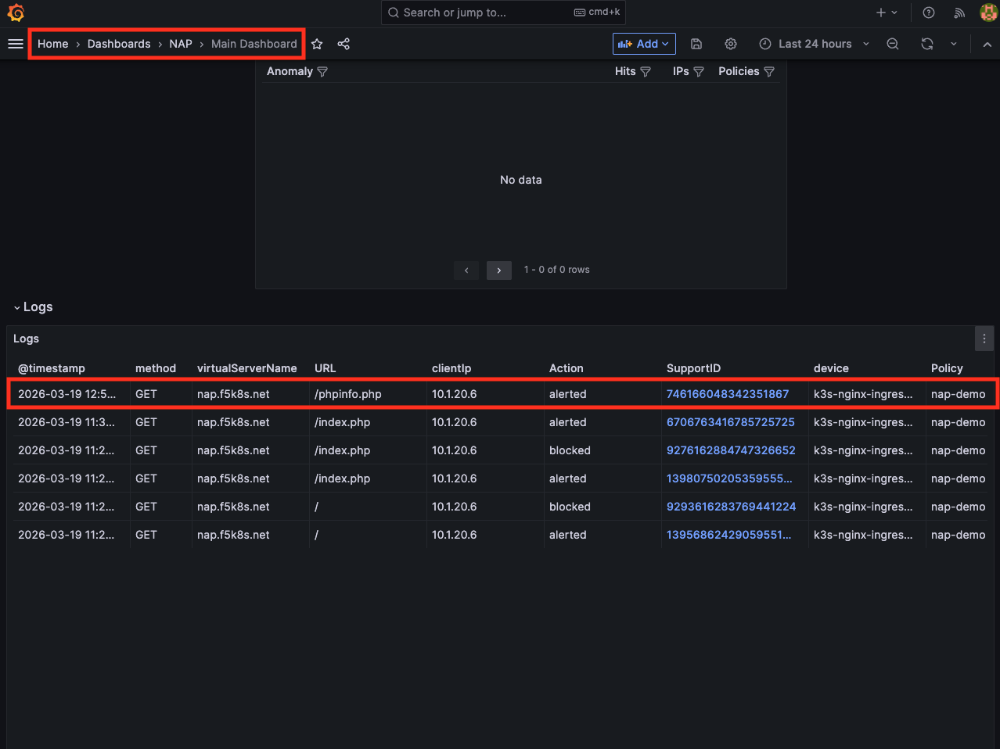
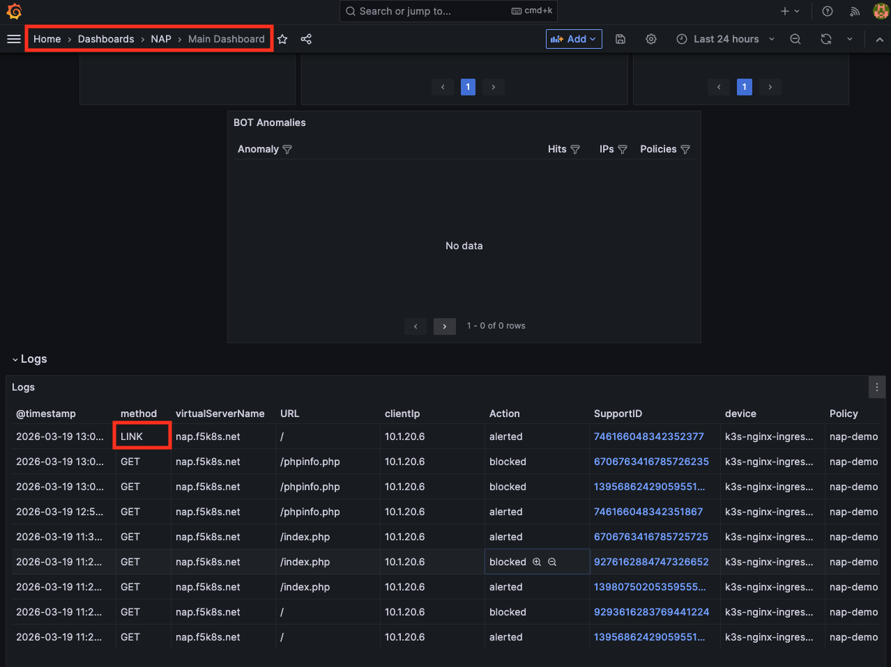

# F5 WAF for NGINX — LAB 4.1: NIC WAF 실습

> **실습 환경:** Client-vscode 터미널  
> **목표:** NGINX Ingress Controller(NIC)에 F5 WAF를 통합하여 공격 시그니처 및 HTTP 메소드 위반을 탐지·차단한다.

---

## 목차

1. [F5 WAF for NGINX 소개](#1-f5-waf-for-nginx-소개)
2. [기본 환경 구성](#2-기본-환경-구성)
3. [공격 시그니처 작업](#3-공격-시그니처-작업)
   - [특정 시그니처 비활성화 (예외 처리)](#31-특정-시그니처-비활성화-예외-처리)
   - [시그니처 활성화 (단일 / 그룹)](#32-시그니처-활성화-단일--그룹)
4. [HTTP 메소드 작업](#4-http-메소드-작업)

---

## 1. F5 WAF for NGINX 소개

**F5 WAF for NGINX**(구 NGINX App Protect WAF)는 NGINX Plus에 F5 WAF 엔진을 결합한 엔터프라이즈급 보안 솔루션입니다. DevOps 환경의 민첩성을 유지하면서 강력한 위협 방어 기능을 제공합니다.

| 특징 | 설명 |
|---|---|
| **고성능 · 경량화** | 컨테이너 및 마이크로서비스 환경에 최적화 |
| **DevSecOps 통합** | 선언적(Declarative) 정책 관리로 CI/CD 파이프라인에 보안 통합 |
| **강력한 위협 방어** | OWASP Top 10, Layer 7 DoS, 봇 공격 등 다양한 공격 방어 |
| **API 보안** | OpenAPI 스키마 검증 및 API 관련 공격 방어 |

<p align="center">
  
  <br><em>[F5 WAF for NGINX 아키텍처]</em>
</p>

### 이번 실습에서 다루는 공격 유형

- **공격 시그니처 (Attack Signatures)**
- **HTTP 메소드 (HTTP Methods)**

### Grafana URL 및 접속 계정 정보 확인

<p align="center">
  
</p>


<p align="center">
  
</p>


<p align="center">
  
</p>

---

## 2. 기본 환경 구성

앞서 구성된 K8S 환경과 NIC(WAF 포함)를 사용하여 애플리케이션을 배포하고, 기본 WAF 정책을 적용합니다.

### 사전 준비: K8S 프로파일 설정

> **실행 환경:** Client-vscode 터미널

```bash
# K8S 컨텍스트를 rancher1로 전환
kubectl config use-context rancher1

# 실습 디렉토리로 이동
cd /home/ubuntu/2026-F5-DevOps-Academy/4.f5-waf-for-nginx/4.1_nic_waf
```

```bash
# Host 파일에 nap.f5k8s.net 도메인 추가
sudo vi /etc/hosts

10.1.10.100 cafe.ing.example.com cafe.vs.example.com webapp.vs.example.com nap.f5k8s.net
```
---

### 배포 파일 요약

| 파일 | 리소스 종류 | 역할 |
|---|---|---|
| `app.yml` | Deployment, Service | Webapp 애플리케이션 배포 |
| `appolicy.yml` | APPolicy | F5 WAF 보안 정책 정의 |
| `log.yml` | APLogConf | WAF 로그 형식 및 필터 설정 |
| `policy.yml` | Policy (NGINX) | APPolicy + APLogConf를 묶어 NIC에 적용 |
| `virtual-server.yml` | VirtualServer | Policy를 Webapp에 연결하여 외부에 노출 |

---

### Step 1 · 애플리케이션 배포 (`app.yml`)

`app.yml`은 `nap` 네임스페이스에 Webapp `Deployment`와 `Service`를 정의합니다.

```bash
# 네임스페이스 생성 후 앱 배포
kubectl create namespace nap
kubectl apply -f app.yml

# 배포 상태 확인
kubectl get pod -n nap && kubectl get service -n nap
```

---

### Step 2 · WAF 정책 정의 (`appolicy.yml`)

`APPolicy`는 WAF의 핵심 보안 정책 리소스입니다.  
**`POLICY_TEMPLATE_NGINX_BASE`** 템플릿은 모든 정책의 출발점으로, 기본 설정 그대로 사용합니다.

```bash
cat appolicy.yml
```

```yaml
apiVersion: appprotect.f5.com/v1beta1
kind: APPolicy
metadata:
  name: nap-demo
  namespace: nap
spec:
  policy:
    applicationLanguage: utf-8
    enforcementMode: blocking   # 차단(blocking) 모드로 동작
    name: nap-demo
    template:
      name: POLICY_TEMPLATE_NGINX_BASE
```

```bash
kubectl apply -f appolicy.yml
kubectl get APPolicy -n nap
```

---

### Step 3 · 로그 설정 (`log.yml`)

`APLogConf`는 WAF 로그의 출력 형식, 최대 메시지 크기, 기록할 요청 유형(여기서는 `illegal`만)을 정의합니다.

```bash
cat log.yml
```

```yaml
apiVersion: appprotect.f5.com/v1beta1
kind: APLogConf
metadata:
  name: logconf
  namespace: nap
spec:
  content:
    format: user-defined                  # 로그 형식을 직접 정의
    format_string: "{\"campaign_names\":\"%threat_campaign_names%\",\"bot_signature_name\":\"%bot_signature_name%\",\"bot_category\":\"%bot_category%\",\"bot_anomalies\":\"%bot_anomalies%\",\"enforced_bot_anomalies\":\"%enforced_bot_anomalies%\",\"client_class\":\"%client_class%\",\"client_application\":\"%client_application%\",\"json_log\":%json_log%}"
    max_message_size: 30k                 # 로그 메시지 최대 크기
    max_request_size: "500"               # 기록할 요청 본문 최대 크기 (bytes)
    escaping_characters:
    - from: "%22%22"
      to: "%22"
  filter:
    request_type: illegal                 # 위반(차단/경고) 요청만 로그 기록
```

```bash
kubectl apply -f log.yml
kubectl get APLogConf -n nap
```

---

### Step 4 · NGINX 정책 생성 (`policy.yml`)

`APPolicy`와 `APLogConf`를 조합하여 NIC에 적용할 최종 정책을 생성합니다.  
로그는 Elasticsearch(Fluentd 경유)와 로컬 syslog 두 곳으로 전송됩니다.

```bash
cat policy.yml
```

```yaml
apiVersion: k8s.nginx.org/v1
kind: Policy
metadata:
  name: waf-policy-demo
  namespace: nap
spec:
  waf:
    enable: true
    apPolicy: "nap-demo"
    securityLogs:
    - enable: true
      apLogConf: "logconf"
      logDest: "syslog:server=fluentd-svc.fluentd:8515"   # Elasticsearch로 전달
    - enable: true
      apLogConf: "logconf"
      logDest: "syslog:server=127.0.0.1:1514"             # 로컬 syslog
```

```bash
kubectl apply -f policy.yml
kubectl get Policy.k8s.nginx.org -n nap
```

---

### Step 5 · VirtualServer 배포 (`virtual-server.yml`)

`waf-policy-demo` 정책을 Webapp에 연결하고, NIC를 통해 외부로 노출합니다.

```bash
cat virtual-server.yml
```

```yaml
apiVersion: k8s.nginx.org/v1
kind: VirtualServer
metadata:
  name: webapp
  namespace: nap
spec:
  host: nap.f5k8s.net
  policies:
  - name: waf-policy-demo         # WAF 정책 연결
  upstreams:
  - name: webapp
    service: webapp-svc
    port: 80
  routes:
  - path: /
    action:
      pass: webapp
```

```bash
kubectl apply -f virtual-server.yml
kubectl get virtualserver.k8s.nginx.org -n nap
```

---

### Step 6 · 동작 확인

**정상 요청 테스트:**

> CIS, NIC가 정상적으로 배포되어야 하며, IngressLink 서비스가 없으면 연결되지 않습니다.

```bash
curl http://nap.f5k8s.net/
```

```
Server address: 10.221.0.34:80
Server name: webapp-67dccc8679-kk6r4
Date: 19/Mar/2026:02:22:40 +0000
URI: /
Request ID: 09abb04dfd4d762f2d206caceaf0d90b
```

**XSS 공격 테스트 (차단 확인):**

```bash
# <script> 태그를 포함한 XSS 시도
curl "http://nap.f5k8s.net/?test=<script>"
```

```html
<!-- WAF가 요청을 차단하고 아래 페이지를 반환 -->
<html><head><title>Request Rejected</title></head>
<body>The requested URL was rejected. Please consult with your administrator.
<br><br>Your support ID is: 9293616283769441224</body></html>
```

**Grafana 확인:** 차단 이벤트는 Grafana 대시보드에서 실시간으로 조회할 수 있습니다. 이벤트 모니터링은 NIM(4.3 시나리오에서 진행)에서도 가능하며, 4.3 Lab에서 진행 예정입니다.

<p align="center">
  
</p>

---

## 3. 공격 시그니처 작업

기본 정책(`POLICY_TEMPLATE_NGINX_BASE`)의 시그니처 모드는 아래와 같이 동작:

| 시그니처 그룹 | 기본 모드 |
|---|---|
| High Accuracy Signatures | **차단 (Blocking)** |
| Medium Accuracy Signatures | 경고 (Alarm) only |
| Low Accuracy Signatures | 경고 (Alarm) only |

---

### 3.1 특정 시그니처 비활성화 (예외 처리)

시스템 운영에 필요한 정상 요청이 High Accuracy 시그니처에 걸리는 경우, 해당 시그니처를 비활성화하여 예외 처리합니다.

**1단계 · 차단 여부 확인:**

```bash
# OS 커맨드 인젝션 패턴이 포함된 요청 전송
curl "http://nap.f5k8s.net/index.php?id=0;%20ls%20-l"
```

```html
<!-- 차단됨 -->
<html><head><title>Request Rejected</title></head>
<body>...Your support ID is: 9276162884747326652...</body></html>
```

**2단계 · Grafana에서 Hit된 시그니처 ID 확인:**

1. 응답의 `support id` 복사
2. Grafana **SupportID 대시보드**에서 해당 ID로 검색
3. 상태가 `blocked`인 것을 확인하고 **Hit된 Signature ID 3개**를 복사

<p align="center">
  
</p>

**3단계 · 해당 시그니처 비활성화를 위해 APPolicy 수정:**

```bash
cat <<EOF | kubectl apply -f -
apiVersion: appprotect.f5.com/v1beta1
kind: APPolicy
metadata:
  name: nap-demo
  namespace: nap
spec:
  policy:
    applicationLanguage: utf-8
    enforcementMode: blocking
    name: nap-demo
    template:
      name: POLICY_TEMPLATE_NGINX_BASE
    signatures:
    - signatureId: 200003041    # Hit된 시그니처 ID 1
      enabled: false
    - signatureId: 200003913    # Hit된 시그니처 ID 2
      enabled: false
    - signatureId: 200103492    # Hit된 시그니처 ID 3
      enabled: false
EOF
```

**4단계 · 예외 처리 확인 (5~10초 대기 후):**

```bash
curl "http://nap.f5k8s.net/index.php?id=0;%20ls%20-l"
```

```
# 차단 없이 정상 응답 반환
Server address: 10.221.0.34:80
Server name: webapp-67dccc8679-kk6r4
Date: 19/Mar/2026:02:34:31 +0000
URI: /index.php?id=0;%20ls%20-l
Request ID: 189afe98a106447bc40944385098879c
```

---

### 3.2 시그니처 활성화 (단일 / 그룹)

#### (A) 단일 시그니처 활성화

Medium Accuracy에 속하는 특정 시그니처(phpinfo 탐지)를 차단 모드로 변경해보겠습니다.

**현재 상태 확인 — 차단되지 않음:**

```bash
curl "http://nap.f5k8s.net/phpinfo.php"
```

```
# 기본 정책에서 Medium Accuracy는 Alarm only → 차단 없음
Server address: 10.221.0.34:80
...
URI: /phpinfo.php
```

> Grafana Main 대시보드에서 해당 URL이 **경고(Alerted)**는 되었지만 **차단(Blocked)**되지 않은 것을 확인할 수 있습니다.

<p align="center">
  
</p>

**사용자 정의 시그니처 세트로 단일 시그니처 차단 활성화를 위해 APPolicy 수정:**

```bash
cat <<EOF | kubectl apply -f -
apiVersion: appprotect.f5.com/v1beta1
kind: APPolicy
metadata:
  name: nap-demo
  namespace: nap
spec:
  policy:
    applicationLanguage: utf-8
    enforcementMode: blocking
    name: nap-demo
    template:
      name: POLICY_TEMPLATE_NGINX_BASE
    signature-sets:
      - name: Custom-picked-signatures
        block: true
        alarm: true
        signatureSet:
          signatures:
            - signatureId: 200010015   # phpinfo 탐지 시그니처
EOF
```

**차단 확인 (5~10초 대기 후):**

```bash
curl "http://nap.f5k8s.net/phpinfo.php"
```

```html
<!-- 차단됨 -->
<html><head><title>Request Rejected</title></head>
<body>...Your support ID is: 13956862429059551793...</body></html>
```

---

#### (B) Medium Accuracy 시그니처 전체 활성화

개별 시그니처 지정 없이 **Medium Accuracy 그룹 전체**를 차단 모드로 설정합니다.

```bash
cat <<EOF | kubectl apply -f -
apiVersion: appprotect.f5.com/v1beta1
kind: APPolicy
metadata:
  name: nap-demo
  namespace: nap
spec:
  policy:
    applicationLanguage: utf-8
    enforcementMode: blocking
    name: nap-demo
    template:
      name: POLICY_TEMPLATE_NGINX_BASE
    signature-sets:
    - name: "Medium Accuracy Signatures"
      block: true    # 차단 모드 활성화
      alarm: true    # 로그 기록 유지
EOF
```

**차단 확인 (5~10초 대기 후):**

```bash
curl "http://nap.f5k8s.net/phpinfo.php"
```

```html
<!-- Medium Accuracy 전체가 차단 모드이므로 동일하게 차단됨 -->
<html><head><title>Request Rejected</title></head>
<body>...Your support ID is: 6706763416785726235...</body></html>
```

---

## 4. HTTP 메소드 작업

기본 정책에 정의된 **허용 HTTP 메소드 목록:**

| 허용 메소드 | 비고 |
|---|---|
| GET, HEAD, POST | 일반적인 읽기/쓰기 |
| PUT, PATCH, DELETE | REST API용 |
| OPTIONS | CORS Preflight |

목록에 없는 메소드(`LINK` 등)는 `허용되지 않는 메소드(Illegal Method)` 위반으로 분류되며, **기본값은 경고(Alarm) 모드**입니다.

---

### Step 1 · 비허용 메소드 전송 (현재: 경고만, 차단 안 됨)

```bash
# 허용 목록에 없는 LINK 메소드로 요청
curl -X LINK "http://nap.f5k8s.net"
```

```
# Alarm 모드이므로 차단 없이 정상 응답
Server address: 10.221.0.34:80
...
URI: /
Request ID: fe7da455c2335202478004d235a048f5
```

> Grafana Main 대시보드에서 `LINK` 메소드가 **경고(Alerted)**로 기록되어 있음을 확인합니다.

<p align="center">
  
</p>

---

### Step 2 · 비허용 메소드 차단 모드로 전환

`VIOL_METHOD` 위반을 차단(Block) 모드로 변경합니다.

```bash
cat <<EOF | kubectl apply -f -
apiVersion: appprotect.f5.com/v1beta1
kind: APPolicy
metadata:
  name: nap-demo
  namespace: nap
spec:
  policy:
    applicationLanguage: utf-8
    enforcementMode: blocking
    name: nap-demo
    template:
      name: POLICY_TEMPLATE_NGINX_BASE
    blocking-settings:
      violations:
      - name: VIOL_METHOD    # 비허용 HTTP 메소드 위반
        alarm: true          # 로그 기록 유지
        block: true          # 차단 모드 추가
EOF
```

**차단 확인 (5~10초 대기 후):** 

```bash
curl -X LINK "http://nap.f5k8s.net"
```

```html
<!-- 차단됨 -->
<html><head><title>Request Rejected</title></head>
<body>...Your support ID is: 13956862429059552303...</body></html>
```

---

## 실습 요약

| 작업 | 설정 위치 | 핵심 필드 |
|---|---|---|
| 특정 시그니처 비활성화 | `APPolicy.spec.policy.signatures` | `enabled: false` |
| 단일 시그니처 차단 활성화 | `APPolicy.spec.policy.signature-sets` | `signatureSet.signatures[].signatureId` |
| 시그니처 그룹 전체 활성화 | `APPolicy.spec.policy.signature-sets` | `name: "Medium Accuracy Signatures"` |
| 비허용 HTTP 메소드 차단 | `APPolicy.spec.policy.blocking-settings` | `VIOL_METHOD: block: true` |

---

*LAB 4.1 End*

[**Lab 4.2로 이동**](../4.2_nic_multi_waf/README.md)